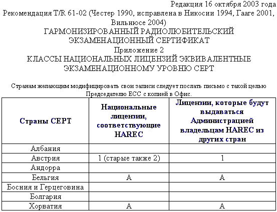
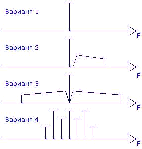
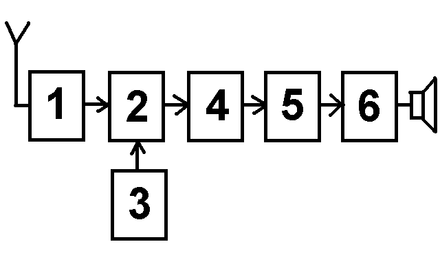
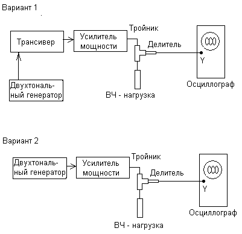
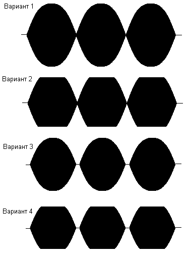

# Международные правила, нормы и терминология, относящиеся к любительской службе

## Вопрос №1

С какими радиостанциями может проводить радиосвязи любительская станция, если она НЕ участвует в проведении аварийно-спасательных работ?

- С любительскими радиостанциями и радиостанциями гражданского «Си - Би» диапазона (27 МГц)
- С любительскими радиостанциями и радиостанциями стандартов LPD (433 МГц, 10мВт) и PMR (446 МГц, 0,5 Вт)
- С любительскими радиостанциями, радиостанциями гражданского «Си - Би» диапазона (27 МГц), а также с радиостанциями стандартов LPD (433 МГц, 10мВт) и PMR (446 МГц, 0,5 Вт)
- Только с любительскими радиостанциями

## Вопрос №2

В каких случаях любительская радиостанция может передавать кодированные сообщения?

- Только при работе вне любительских диапазонов
- Не регламентируется
- При участии в аварийно-спасательной связи
- Ни в каких, при этом передача контрольного номера в соревнованиях по радиоспорту, а также управляющих команд и телеметрии любительских радиостанций наземного и космического базирования не относится к передачам с использованием кодировки сигнала

## Вопрос №3

Разрешено ли радиостанции любительской службы создание преднамеренных помех другим радиостанциям?

- Разрешено, если станция другой службы работает на более низкой основе
- Не разрешено в диапазонах совместного использования с другими службами связи
- Не разрешено
- Разрешено, если это «радиохулиган», который не реагирует на требования прекратить передачу

## Вопрос №4

Разрешено ли радиостанции любительской службы передавать какие-либо сообщения за плату?

- Разрешено, если это реклама
- Не разрешено
- Не разрешено на частотах ниже 30 МГц
- Разрешено, если это телеграммы в труднодоступные районы страны

## Вопрос №5

Как называется станция любительской службы, производящая односторонние передачи в целях изучения условий распространения радиоволн?

- Цифровая станция
- Радиомаяк
- Станция радиоуправления
- Ретранслятор

## Вопрос №6

Может ли станция любительской службы проводить радиосвязи с радиостанциями, не имеющими отношения к любительской службе?

- Не может
- Может, если эти станции имеют Свидетельства о регистрации РЭС
- Может для выяснения, на какой основе (первичной или вторичной) работают эти радиостанции
- Может в случае стихийных бедствий, при проведении аварийно-спасательных работ

## Вопрос №7

Если радиооператор любительской радиостанции слышит сигнал бедствия на частоте, на которой он не имеете права осуществлять передачу, что ему разрешено сделать для помощи станции, терпящей бедствие?

- Ему разрешено помогать станции, терпящей бедствие, на любых частотах любым доступным способом
- Ему разрешено помогать, только если сигналы его радиостанции будут на ближайшей частоте в разрешенных границах
- Ему разрешено помогать вне разрешённых частот передачи, если только он использует международный код Морзе
- Ему не разрешено помогать, потому что сигнал лежит вне границ разрешенных ему частот

## Вопрос №8

На сколько условных районов разделён земной шар по схеме деления на районы IARU (ITU)?

- На три
- На пять
- На два
- На четыре

## Вопрос №9

Какие территории входят в первый район IARU (ITU)?

- Южная Америка
- Австралия и Океания
- Северная Америка
- Африка, Европа, страны бывшего СССР

## Вопрос №10

На основании рекомендаций какой организации в различных странах Европы и ряде неевропейских стран устанавливаются единые требования к квалификации радиолюбителей?

- СРР (Союз радиолюбителей России)
- СЕРТ (Европейская конференция администраций почт и электросвязи)
- WRL (Всемирная радиолюбительская лига)
- ITU (МСЭ, Международный союз электросвязи)

## Вопрос №11

Какой из перечисленных позывных сигналов образован для любительской службы?

- RA3A
- БЕРЁЗА
- АТ-321
- RIT

## Вопрос №12

Какой из перечисленных позывных сигналов образован для любительской службы?

- RA9EM
- RMT
- MO13
- ФОНАРЬ

## Вопрос №13

Какой позывной сигнал не относится к любительской службе?

- RIT
- R4IT
- R44ITU
- R8SRR

## Вопрос №14

Как называется международная организация радиолюбителей?

- СЕРТ (Европейская конференция администраций почт и электросвязи)
- IARU (Международный радиолюбительский союз)
- WRL (Всемирная радиолюбительская лига)
- ITU (МСЭ, Международный союз электросвязи)

## Вопрос №15

Что обозначает сокращение «DX»?

- Дальнюю или редкую радиостанцию
- Радиостанцию, работающую в соревнованиях
- Радиостанцию, работающую с плохим сигналом
- Радиостанцию, работающую малой мощностью

## Вопрос №16

При каких условиях любительская радиостанция может использоваться на борту морского или воздушного судна

- С согласия командира судна и при условии соблюдения всех правил по обеспечению безопасности полетов или мореплавания
- С согласия владельца судна
- При наличии разрешений Морского или Воздушного Регистров
- При любых условиях

## Вопрос №17

Разрешается ли допуск на любительскую радиостанцию лица, не имеющего квалификацию или имеющего квалификацию более низкой категории?

- Не допускается
- Допускаются только лица не старше 19 лет
- Допускается исключительно в целях обучения и при условии обеспечения непрерывного контроля за его работой
- Допускается только при участии в соревнованиях

## Вопрос №18

Какой российский документ имеет силу полной лицензии СЕРТ?

- Свидетельство об образовании позывного сигнала опознавания радиолюбителя третьей квалификационной категории
- Свидетельство об образовании позывного сигнала опознавания радиолюбителя первой категории
- Свидетельство о регистрации РЭС первой категории
- Свидетельство об образовании позывного сигнала опознавания радиолюбителя первой или второй квалификационной категории

## Вопрос №19

Какой российский документ имеет силу лицензии СЕРТ новичка (Novice)?

- Свидетельство об образовании позывного сигнала опознавания радиолюбителя третьей квалификационной категории
- Свидетельство о регистрации РЭС третьей квалификационной категории
- Свидетельство об образовании позывного сигнала опознавания радиолюбителя первой или второй квалификационной категории
- Свидетельство о регистрации РЭС четвёртой квалификационной категории

## Вопрос №20

В течение какого времени радиооператор любительской радиостанции, нерезидент, - обладатель полной или Novice - лицензии СЕРТ может осуществлять передачи с территории России без получения разрешительных документов?

- Не имеет права
- 90 дней
- Ограничений нет
- 1 год

## Вопрос №21

Какой позывной сигнал должен передавать радиолюбитель, осуществляющий передачи при посещении страны, присоединившейся к рекомендациям СЕРТ T/R 61-01 и ЕСС(05)06 ?

- Передаётся свой позывной сигнал, после которого через дробь следует буква "Р"
- После своего позывного сигнала через дробь передаётся префикс страны пребывания
- Перед своим позывным сигналом через дробь передаётся префикс страны пребывания
- Передаётся только свой позывной сигнал

## Вопрос №22

Какой позывной сигнал должен использовать российский радиолюбитель с позывным сигналом RL3DX, не имеющий бельгийской национальной радиолюбительской лицензии, для осуществления передач с территории Бельгии в течение первых 90 дней пребывания? Смотри подсказку.

- ON33DX
- ON/RL3DX
- RL3DX/ON
- RL3DX

## Вопрос №23

Какой позывной сигнал должен использовать российский радиолюбитель с позывным сигналом RL3DX, не имеющий австрийской национальной радиолюбительской лицензии, для осуществления передач с территории Австрии в течение первых 90 дней пребывания? Смотри подсказку.

- RL3DX/OE
- OE83DX
- OE/RL3DX
- RL3DX

## Вопрос №24

В каком документе содержатся сведения о том, в соответствии с какой национальной радиолюбительской лицензией может осуществлять передачи владелец полной или Novice - лицензии СЕРТ в стране пребывания? Как найти этот документ?

- В соответствии с решением Роскомнадзора. Находится в интернете на сайте Роскомнадзора по адресу [http://www.rsoc.ru](http://www.rsoc.ru)
- В соответствии с приложением № 2 рекомендации СЕРТ T/R 61-01. Находится в интернете на сайте Европейского комитета по радиосвязи по адресу [http://www.ero.dk](http://www.ero.dk)
- В соответствии с решением Союза радиолюбителей России. Находится в интернете на сайте СРР по адресу [http://www.srr.ru](http://www.srr.ru)
- В соответствии с последним Решением ГКРЧ по радиолюбителям. Находится в интернете на сайте ГРЧЦ по адресу [http://www.grfc.ru](http://www.grfc.ru)

## Вопрос №25

Может ли обладатель Свидетельства об образовании позывного сигнала опознавания четвёртой квалификационной категории осуществлять передачи из стран пребывания, присоединившихся к рекомендациям СЕРТ T/R 61-01 и ЕСС(05)06?

- Может в соответствии с полной лицензией СЕРТ
- Может в соответствии с лицензией СЕРТ новичка (Novice)
- Нет, не может
- Может в соответствии с международной лицензией СЕРТ

## Вопрос №26

Даёт ли полная или Novice - лицензия СЕРТ, право беспрепятственно осуществлять ввоз и вывоз любительской аппаратуры в страны - члены СЕРТ?

- Даёт, но только в страны - члены СЕРТ
- Даёт, но только в страны, присоединившейся к рекомендациям СЕРТ T/R 61-01 и ЕСС(05)06
- Не даёт. Рекомендации СЕРТ не заменяют таможенные правила и не имеют отношения к ввозу и вывозу радиолюбительской аппаратуры
- Даёт, но только радиолюбителю первой квалификационной категории

## Вопрос №27

Какую функцию выполняет гармонизированный радиолюбительский экзаменационный сертификат HAREC?

- Это справка о сдаче экзамена по программе полной лицензии СЕРТ, на основании которой Администрация связи страны пребывания выдаёт национальную радиолюбительскую лицензию без экзамена
- Это лицензия, на основании которой радиолюбитель может осуществлять передачи из стран - членов СЕРТ в течение 90 дней
- Это справка о сдаче экзамена по программе лицензии СЕРТ новичка (Novice), на основании которой Администрация связи страны пребывания выдаёт национальную радиолюбительскую лицензию без экзамена
- Это свидетельство о членстве радиолюбителя в национальной радиолюбительской организации

## Вопрос №28

Какую функцию выполняет радиолюбительский экзаменационный сертификат новичка ARNEC?

- Это свидетельство о членстве радиолюбителя в национальной радиолюбительской организации
- Это лицензия, на основании которой радиолюбитель может осуществлять передачи из стран - членов СЕРТ в течение 90 дней
- Это справка о сдаче экзамена по программе полной лицензии СЕРТ, на основании которой Администрация связи страны пребывания выдаёт национальную радиолюбительскую лицензию без экзамена
- Это справка о сдаче экзамена по программе лицензии СЕРТ новичка (Novice), на основании которой Администрация связи страны пребывания выдаёт национальную радиолюбительскую лицензию без экзамена

## Вопрос №29

Какой позывной сигнал должен использовать для опознавания своей радиостанции владелец лицензии СЕПТ при временном (до 90 дней) посещении России?

- Свой позывной и далее после дроби условный номер федерального округа
- R/ и далее свой позывной
- RB/ и далее свой позывной
- RA/ и далее свой позывной

## Вопрос №30

Какой позывной сигнал должен использовать для опознавания своей радиостанции владелец лицензии СЕПТ "новичка" (CEPT NOVICE) при временном (до 90 дней) посещении России?

- RU/ и далее свой позывной
- Свой позывной и далее после дроби условный номер федерального округа
- RC/ и далее свой позывной
- RA/ и далее свой позывной

## Вопрос №31

Какую возможность даёт российскому радиолюбителю наличие лицензии CEPT в стране, присоединившейся к рекомендации СЕРТ T/R 61-02 и сообщению ERC 32 по получению документов?

- Получить национальную радиолюбительскую лицензию страны, присоединившейся к рекомендации CEPT T/R 61-02 и сообщению ERC 32 и международный экзаменационный сертификат (HAREC или ARNE- без экзамена на основании лицензии CEPT
- Никакой дополнительной возможности для получения документов
- Получить только национальную радиолюбительскую лицензию страны, присоединившейся к рекомендации CEPT T/R 61-02 и сообщению ERC 32 без экзамена на основании лицензии CEPT
- Получить только международный экзаменационный сертификат (HAREC или ARNE- без экзамена на основании лицензии CEPT

## Вопрос №32

Какую национальную радиолюбительскую лицензию в Бельгии может без экзаменов получить российский радиолюбитель, имеющий Гармонизированный экзаменационный сертификат HAREC? (Смотри подсказку)

- Лицензию СЕРТ
- Лицензию класса "А"
- Лицензию второй категории
- Лицензию HAREC

## Вопрос №33

Где можно сдать международный экзамен на получение гармонизированного радиолюбительского экзаменационного сертификата HAREC?

- Международных экзаменов на получение гармонизированного экзаменационного сертификата HAREC не существует. Каждая страна СЕРТ организует национальные экзамены в соответствии с темами, перечисленными в приложении № 6 рекомендаций T/R61-02
- В штаб - квартире ITU в Вене
- Заочно в интернете на сайте Европейского комитета по радиосвязи по адресу [http://www.ero.dk](http://www.ero.dk)
- В штаб - квартире СЕРТ в Женеве

## Вопрос №34

Может ли гражданин России сдать экзамен на получение гармонизированного радиолюбительского экзаменационного сертификата HAREC за пределами России?

- Нет, не может
- Может, если он является членом национальной радиолюбительской организации
- Да, может. Для этого гражданин России должен сдать национальный радиолюбительский экзамен в любой стране СЕРТ, на квалификационную категорию (класс), соответствующую полной лицензии CEPT
- Может - только в штаб - квартире ITU

## Вопрос №35

Как Регламентом радиосвязи Международного союза электросвязи определены цели любительской службы?

- Самообучение, переговорная связь и технические исследования
- Взаимная радиосвязь на территориях со слабым развитием сетей связи общего пользования
- Такого определения нет
- Бесплатная переговорная радиосвязь

## Вопрос №36

Как Регламентом радиосвязи Международного союза электросвязи определены лица, допущенные к любительской службе?

- Такого определения нет
- Лица, имеющие стационарную, либо мобильную радиостанцию
- Лица, имеющие должное разрешение и занимающимися радиотехникой исключительно из личного интереса и без извлечения материальной выгоды
- Лица, имеющие мобильную радиостанцию

## Вопрос №37

Как Регламентом радиосвязи Международного союза электросвязи определена Администрация связи?

- Любое правительственное учреждение или служба, ответственное за развитие сетей связи в стране
- Любая организация, осуществляющая надзор за использованием в стране радиочастотного спектра
- Любое правительственное учреждение или служба, ответственное за выполнение обязательств по Уставу Международного союза электросвязи, по Конвенции Международного союза электросвязи и по Административным регламентам
- Любая организация страны – участника, заявившая о том, что она администрирует сети связи в своей стране

## Вопрос №38

Какая из перечисленных любительских радиостанций вправе претендовать на то, что какая-либо из частот будет закреплена за ней постоянно или будет освобождена для ней в какой-то момент времени: радиостанция, участвующая в соревнованиях, радиостанция, участвующая в тренировке аварийной радиолюбительской службы, радиостанция, ведущая «круглый стол»?

- Радиостанция, участвующая в тренировке аварийной радиолюбительской службы
- Радиостанция, ведущая «круглый стол»?
- Радиостанция, участвующая в соревнованиях
- Ни одна из радиостанций

## Вопрос №39

Какие виды помех определены Регламентом радиосвязи Международного союза электросвязи?

- Допустимая, недопустимая, неприемлемая
- Допустимая, приемлемая, неприемлемая
- Допустимая, приемлемая, вредная
- Допустимая, недопустимая, вредная

## Вопрос №40

Как в соответствии с Регламентом радиосвязи Международного союза электросвязи называется помеха, существенно ухудшающая качество, затрудняющая или неоднократно прерывающая работу службы радиосвязи?

- Критическая
- Недопустимая
- Вредная
- Неприемлемая

## Вопрос №41

Как в соответствии с Регламентом радиосвязи Международного союза электросвязи называется помеха, согласованная Администрациями связи

- Согласованная
- Вредная
- Критическая
- Приемлемая

## Вопрос №42

Как в соответствии с Регламентом радиосвязи Международного союза электросвязи называется помеха, удовлетворяющая количественным критериям помехи и критериям совместного использования частот?

- Вредная
- Допустимая
- Приемлемая
- Согласованная

## Вопрос №43

Какое воздействие на систему радиосвязи в соответствии с Регламентом радиосвязи Международного союза электросвязи определяется как помеха?

- Такого определения нет
- Воздействие от работы любой радиостанции на вторичной основе
- Воздействие, вызывающее дополнительную нагрузку на радиооператора
- Воздействие, проявляющееся в любом ухудшении качества, ошибках или потере информации

## Вопрос №44

Радиостанция, работающая однополосной модуляцией с частотой несущей 7070 кГц и нижней боковой полосой по причине плохой линейности выходного каскада занимает полосу 7060 – 7070 кГц. Как в соответствии с Регламентом радиосвязи Международного союза электросвязи квалифицируется излучение этой радиостанции в полосе 7060 – 7067 кГц?

- Вредное излучение
- Побочное излучение
- Внеполосное излучение
- Недопустимое излучение

## Вопрос №45

Радиостанция, работающая однополосной модуляцией с частотой несущей 7070 кГц и нижней боковой полосой, по причине самовозбуждения выходного каскада излучает в двух полосах частот: 7067 – 7070 кГц и 10203 – 10206 кГц. Как в соответствии с Регламентом радиосвязи Международного союза электросвязи квалифицируется излучение этой радиостанции в полосе 10203 – 10206 кГц?

- Вредное излучение
- Внеполосное излучение
- Побочное излучение
- Недопустимое излучение

## Вопрос №46

Чем определяются условия использования выделенных полос радиочастот (частоты, вид связи, мощность) любительской радиостанцией, принадлежащей юридическому лицу?

- Квалификационной категорией управляющего радиооператора
- Стажем работы радиостанции
- Формой собственности юридического лица
- Квалификационной категорией руководителя организации – юридического лица Нормативные правовые акты Российской Федерации, касающиеся использования радиочастотного спектра РЭС любительской службы

## Вопрос №47

Какой из перечисленных диапазонов выделен любительской службе на первичной основе?

- 2 м
- 23 см
- 70 см
- 90 см

## Вопрос №48

Что должен делать радиооператор любительской радиостанции, ведущий передачу в диапазоне частот, выделенном любительской службе на вторичной основе, при требовании прекратить передачу со стороны радиостанции, работающей на первичной основе?

- Продолжать передачу
- Выяснить позывной радиостанции, работающей на первичной основе
- Выяснить местоположение радиостанции, работающей на первичной основе
- Прекратить передачу

## Вопрос №49

Для каких целей предназначена любительская и любительская спутниковая службы в Российской Федерации?

- Для оказания помощи зарубежным странам в улучшении технического состояния сетей радиосвязи и технического мастерства обслуживающего персонала, а также для поощрения визитов зарубежных радиолюбителей
- Для самореализации граждан в сфере любительской радиосвязи и радиоспорта, изучения, исследования и экспериментального использования новых технологий и видов радиосвязи, развития технического творчества детей и молодежи, социальной реабилитации граждан с ограниченными возможностями
- Для разработки радиосхем, увеличения числа разработчиков радиосхем
- Для обеспечения граждан Российской Федерации везде и всегда, где это возможно, бесплатными средствами связи, в том числе мобильными.

## Вопрос №50

Какие темы запрещены для радиообмена в эфире?

- Только угрозы применения насилия, оскорбления и клевета
- Только политика
- Политика, религия коммерческая реклама, высказывания экстремистского характера, угрозы применения насилия, оскорбления и клевета
- Для радиообмена в эфире нет запрещённых тем

## Вопрос №51

Какие сведения запрещены к передаче радиооператорам радиостанций любительской службы?

- Сведения, составляющие государственную тайну
- Сведения, полученные при прослушивании работы любительских радиостанций
- Не регламентируется
- Сведения, полученные от корреспондентов

## Вопрос №52

Какая организация контролирует выполнение правил и требований любительской службы в России?

- Союз радиолюбителей России (СРР)
- Государственная комиссия по радиочастотам (ГКРЧ)
- Роскомнадзор
- Главный радиочастотный центр (ФГУП ГРЧЦ)

## Вопрос №53

Сколько категорий радиолюбителей установлено в России?

- Пять
- Четыре
- Шесть
- Три

## Вопрос №54

Сколько постоянных позывных сигналов может быть образовано любительской радиостанции?

- Только один
- Два, при этом второй — только для обучения
- Нет ограничений
- Три

## Вопрос №55

Какая категория предоставляет радиолюбителю в России наибольшие возможности работы в эфире?

- Четвёртая
- «Супер»
- Первая
- «Экстра»

## Вопрос №56

Какой максимальной мощностью разрешено производить передачи любительским радиостанциям четвертой категории?

- Один ватт
- Десять ватт
- Пять ватт
- Мощность не ограничена

## Вопрос №57

На каких диапазонах разрешено осуществлять передачи радиооператорам любительских радиостанций четвертой категории самостоятельно с собственной радиостанции?

- На всех диапазонах, выделенных любительской службе в России
- Только на диапазоне 160 метров
- На диапазоне 160 метров и УКВ-диапазонах
- Только на УКВ - диапазонах

## Вопрос №58

С каких радиостанций разрешено осуществлять передачи начинающим радиолюбителям, не имеющим категории?

- С любых радиостанций только под непосредственным контролем управляющего оператора
- С радиостанций 1 и 2 категории только под непосредственным контролем управляющего оператора
- С радиостанций 1 категории только под непосредственным контролем управляющего оператора
- Начинающим радиолюбителям, не имеющим категории, осуществлять передачи запрещено

## Вопрос №59

С каких радиостанций разрешено осуществлять передачи в диапазоне коротких волн радиооператорам любительских радиостанций четвёртой категории?

- Радиооператорам любительских радиостанций четвёртой категории осуществлять передачи в диапазоне коротких волн запрещено
- С радиостанций физических и юридических лиц, имеющих 1 категорию
- С радиостанций физических и юридических лиц, имеющих 1, 2 и 3 категорию и только под непосредственным контролем управляющего оператора
- С радиостанций физических и юридических лиц, имеющих 1, и 2 категорию

## Вопрос №60

Из каких частей состоит позывной сигнал?

- Суффикс и астериск
- Суффикс и приставка
- Префикс и астериск
- Префикс и суффикс

## Вопрос №61

Как правильно записывается позывной, произнесенный в эфире как "Роман-Жук-ТриДмитрий-Анна-Василий"?

- RW3DAV
- RV3DAW
- RQ3DAW
- RG3DAV

## Вопрос №62

Как правильно записывается позывной, произнесенный в эфире как "Роман-Знак-ТриДмитрий-Галина-Зинаида"?

- RZ3DHZ
- RZ3DGX
- RZ3DGZ
- RX3DGZ

## Вопрос №63

Как правильно записывается позывной, произнесенный в эфире как "Ульяна-Анна-ТриЩука-Жук-Иван-Краткий"?

- UA3QVI
- UA3QVJ
- UA3VQJ
- UA3VQIK

## Вопрос №64

Укажите позывной радиооператора любительской радиостанции из России

- UA9AAA
- UK8AAA
- US5AAA
- UN8AAA

## Вопрос №65

Какой из перечисленных ниже позывных используется для опознавания любительской радиостанции, установленной на автомобиле или речном судне?

- UA3AA/s
- UA3AA/m
- UA3AA/mm
- UA3AA/z

## Вопрос №66

Какой позывной сигнал использовал Э. Т. Кренкель?

- UW3DI
- R1FL
- UA1FA
- RAEM

## Вопрос №67

Кому принадлежал позывной сигнал RAEM?

- Кудрявцев Ю. Н.
- Кренкель Э. Т.
- Лаповок Я. С.
- Лбов Ф. А.

## Вопрос №68

Укажите позывной сигнал любительской радиостанции, принадлежащей ветерану Великой Отечественной войны?

- RR3DH
- R73SRR
- U3DI
- R3DAAD/B

## Вопрос №69

Укажите позывной сигнал любительской радиостанции четвёртой категории

- R73SRR
- U3DI
- R3DAAD
- RR3DH

## Вопрос №70

Какие префиксы позывных сигналов выделены для радиолюбителей России?

- R0 - R9, RA0 - RZ9, UA0-UI9
- RA0 - RZ9
- UA0-UZ9
- RA0 - RZ9, UA0-UZ9

## Вопрос №71

Какой мощностью работает радиостанция любительской службы с позывным сигналом UA3AA/QRP?

- Более 200 Ватт
- Нельзя определить
- 5 Ватт, или менее
- Более 1000 Ватт

## Вопрос №72

Когда радиооператор любительской радиостанции может использовать свою любительскую радиостанцию для передачи "SOS" или "MAYDAY" на радиочастотах, выделенных другим службам радиосвязи?

- Когда передано штормовое предупреждение
- Только в определённое время (через 15 или 30 минут после начала часа)
- Никогда
- В исключительных случаях и только при непосредственной угрозе жизни и здоровью граждан

## Вопрос №73

Разрешено ли радиолюбительской станции передавать музыку?

- Разрешено только в вечернее время
- Не разрешено, кроме передачи музыкальных позывных
- Не разрешено
- Разрешено на частотах выше 433 МГц

## Вопрос №74

При каких условиях радиооператор любительской радиостанции может самостоятельно осуществлять передачи с принадлежащей ему радиостанции?

- При наличии у радиооператора членского билета Союза радиолюбителей России
- При наличии у радиооператора Разрешения на эксплуатацию радиостанции
- При наличии у радиооператора Сертификата соответствия на радиостанцию
- При наличии у радиооператора эксплуатационной и технической квалификации, позывного сигнала, регистрации РЭС, а также выполнении Решения ГКРЧ по любительской службе

## Вопрос №75

Какая организация образует позывной сигнал радиостанции любительской службы?

- Государственная комиссия по радиочастотам
- Радиочастотная служба, состоящая из Главного радиочастотного центра, а также радиочастотных центров Федеральных округов и их филиалов в Республиках, краях и областях
- Союз радиолюбителей России
- Территориальное управление Роскомнадзора

## Вопрос №76

Сколько Свидетельств о регистрации радиоэлектронного средства (РЭС), должен получить радиооператор любительской радиостанции?

- По одному на каждое радиоэлектронное средство (трансивер)
- Только одно
- Одно на позывной и по одному на каждый трансивер
- Максимум два: одно на основное место жительства и одно на дачу

## Вопрос №77

Может ли радиолюбитель допустить другого радиолюбителя, не имеющего позывного, для работы со своей радиостанции?

- Может только под личным контролем
- Может только под контролем Роскомнадзора
- Может только под контролем Радиочастотной службы
- Не может

## Вопрос №78

Эксплуатация радиоэлектронных средств без специального разрешения (лицензии), если такое разрешение (лицензия) обязательно (обязательна) влечёт административное наказание физического лица в виде: ?

- Предупреждение в письменной форме
- Административный арест физического лица на срок до пятнадцати суток
- Лишение специального права, предоставленного физическому лицу на три года
- Наложение административного штрафа на физическое лицо с конфискацией радиоэлектронных средств или без таковой

## Вопрос №79

Каким документом российским радиолюбителям выделяются полосы радиочастот для проведения радиосвязей?

- Постановлением Правительства РФ (ППРФ)
- Решением Госинспекции электросвязи РФ (ГИЭ)
- Решением Государственной комиссии по радиочастотам (ГКРЧ)
- Решением Министерства внутренних дел (МВД)

## Вопрос №80

Имеет ли право лицо, не имеющее квалификации радиолюбителя (категории), осуществлять самостоятельно передачи на зарегистрированной любительской радиостанции, переданной ему по доверенности?

- Да, только в случае, если доверенность заверена нотариально
- Да, при наличии разрешения полиции
- Да
- Нет. Лицо, не имеющее квалификации радиолюбителя, может осуществлять передачи только под контролем управляющего оператора, указанного в Свидетельстве о регистрации РЭС

## Вопрос №81

Что определяется Свидетельством об образовании позывного сигнала опознавания?

- Только позывной сигнал любительской радиостанции
- Квалификационная категория радиооператора любительской радиостанции и позывной сигнал опознавания радиостанций
- Свидетельство об образовании позывного сигнала опознавания является разрешением на осуществление радиолюбителем передач с любых радиостанций
- Только квалификационная категория радиооператора любительской радиостанции

## Вопрос №82

В каком случае радиооператор любительской радиостанции может не вести аппаратный журнал?

- При использовании стационарной радиостанции в полосах радиочастот выше 30 МГц
- При проведении радиосвязей цифровыми видами связи
- При использовании мобильной радиостанции в полосах радиочастот выше 30 МГц
- При проведении радиосвязей с местными корреспондентами

## Вопрос №83

Какой минимальный объём информации фиксируется в аппаратном журнале любительской радиостанции?

- Позывной корреспондента и оба рапорта
- Позывной корреспондента, его имя и местонахождение, используемая аппаратура и антенны, краткая характеристика погодных условий
- Дата и время проведения радиосвязи
- Дата и время проведения радиосвязи, диапазон и вид работы, позывной корреспондента

## Вопрос №84

Какой минимальный объём информации фиксируется в аппаратном журнале любительского ретранслятора или радиомаяка?

- При работе любительских ретрансляторов и радиомаяков аппаратный журнал не ведётся
- Выходная мощность и потребляемый ток
- Список позывных сигналов допущенных корреспондентов
- Время включения и выключения

## Вопрос №85

Сколько времени должен храниться аппаратный журнал любительской радиостанции?

- Не менее шести месяцев после того, как он начат
- Не менее одного года после внесения в него последних сведений
- Вечно
- Не менее трёх лет после внесения в него последних сведений

## Вопрос №86

Обязательно ли переносить сведения в аппаратный журнал любительской радиостанции из отдельного журнала учёта радиосвязей, проведённых в соревнованиях?

- Обязательно, если учёт связей в соревнованиях вёлся с использованием компьютера
- Нет
- Обязательно, если учёт связей в соревнованиях вёлся на бумажном носителе
- Да

## Вопрос №87

Можно ли вносить в аппаратный журнал любительской радиостанции какую-либо информацию помимо обязательной

- Можно вносить дополнительную информацию только об используемой аппаратуре и погодных условиях
- Можно вносить дополнительную информацию, только переданную корреспондентом
- Нельзя
- Можно вносить любую дополнительную информацию

## Вопрос №88

Какая полоса частот двухметрового диапазона предназначена для работы частотной модуляцией (FM) без использования наземных ретрансляторов и радиолюбительских спутников?

- 145,206-145,594 МГц
- 145 - 146 МГц
- 144.0 - 144.5 МГц
- 144 - 146 МГц

## Вопрос №89

Каков разнос частот приёма и передачи любительского ретранслятора на диапазоне 70 см?

- 6 МГц
- 600 кГц
- 1,6 МГц
- 100 кГц

## Вопрос №90

Каков разнос частот приёма и передачи любительского ретранслятора на диапазоне 2 м?

- 100 кГц
- 1,6 МГц
- 6 МГц
- 600 кГц

## Вопрос №91

Каков разнос частот приёма и передачи любительского ретранслятора на диапазоне 23 см?

- 100 кГц
- 600 кГц
- 6 МГц
- 1,6 МГц

## Вопрос №92

Какое сообщение может регулярно передавать любительский ретранслятор азбукой Морзе?

- Новости для радиолюбителей
- Значение температуры ретранслятора и напряжение питания
- Телеметрию
- Позывной сигнал ретранслятора

## Вопрос №93

Какие станции пользуются преимуществом при проведении радиосвязей через любительский ретранслятор?

- Стационарные
- Местные
- Иностранные
- Носимые и возимые

## Вопрос №94

Что может потребоваться передавать вашей радиостанции одновременно с речевым сигналом для проведения QSO через любительский ретранслятор?

- Позывной сигнал владельца ретранслятора
- Субтон
- Звук высокого тона, указывающий на окончание передачи
- Позывной сигнал ретранслятора

## Вопрос №95

Какой экзаменационной программе CEPT соответствуют вопросы на четвёртую категорию?

- Сообщению ECC 89 (ENTRY LEVEL)
- Сообщению CEPT ERC32 (ARNEC)
- Рекомендации CEPT T/R 61-02 (HAREC). Дополнительно требуется продемонстрировать умение принимать на слух текст азбукой Морзе со скоростью 60 знаков в минуту
- Рекомендации CEPT T/R 61-02 (HAREC)

## Вопрос №96

Какой экзаменационной программе CEPT соответствуют вопросы на третью категорию?

- Рекомендации CEPT T/R 61-02 (HAREC). Дополнительно требуется продемонстрировать умение принимать на слух текст азбукой Морзе со скоростью 60 знаков в минуту
- Сообщению CEPT ERC32 (ARNEC)
- Рекомендации CEPT T/R 61-02 (HAREC)
- Сообщению ECC 89 (ENTRY LEVEL)

## Вопрос №97

Какой экзаменационной программе CEPT соответствуют вопросы на вторую категорию?

- Рекомендации CEPT T/R 61-02 (HAREC). Дополнительно требуется продемонстрировать умение принимать на слух текст азбукой Морзе со скоростью 60 знаков в минуту
- Сообщению ECC 89 (ENTRY LEVEL)
- Рекомендации CEPT T/R 61-02 (HAREC)
- Сообщению CEPT ERC32 (ARNEC)

## Вопрос №98

Какой экзаменационной программе CEPT соответствуют вопросы на первую категорию?

- Рекомендации CEPT T/R 61-02 (HAREC). Дополнительно требуется продемонстрировать умение принимать на слух текст азбукой Морзе со скоростью 60 знаков в минуту
- Сообщению CEPT ERC32 (ARNEC)
- Сообщению ECC 89 (ENTRY LEVEL)
- Рекомендации CEPT T/R 61-02 (HAREC)

## Вопрос №99

Какова максимально разрешенная мощность любительской радиостанции первой квалификационной категории в диапазоне 1810-2000 кГц?

- 10 Вт
- 500 Вт
- 100 Вт
- 1000 Вт

# Правила и процедуры установления радиосвязи, ведения и окончания радиообмена

## Вопрос №100

Как осуществляется общий вызов (CQ) при голосовой передаче?

- Сначала «Всем», затем несколько раз позывной, затем «приём»
- Сначала «Всем», затем несколько раз имя
- Несколько раз называется свой самостоятельно придуманный «ник»
- Несколько раз называется свой позывной

## Вопрос №101

Что необходимо сделать перед передачей общего вызова (CQ)?

- Убедиться, что операторам других станций не будет создано помех
- Несколько раз перевести радиостанцию в режим передачи
- Несколько раз передать свой позывной
- Дать короткий общий вызов

## Вопрос №102

Как следует отвечать на голосовой общий вызов (CQ)?

- Назвать позывной вызывающей станции, по крайней мере, пять раз по буквам, затем слово "здесь", затем Ваш позывной, по крайней мере, один раз
- Назвать позывной вызывающей станции, по крайней мере, три раза, затем слово "здесь", затем Ваш позывной, по крайней мере, пять раз по буквам
- Назвать позывной вызывающей станции, по крайней мере, один раз, затем слово "здесь", затем Ваш позывной по буквам
- Назвать позывной вызывающей станции, по крайней мере, 10 раз, затем слово "здесь", затем Ваш позывной по крайней мере дважды

## Вопрос №103

Каковы права радиооператоров любительских радиостанций, желающих использовать одну и ту же свободную частоту?

- Радиооператор станции, мощность которой меньше, должен уступить частоту оператору станции, мощность которой больше
- Радиооператоры станций второго и третьего районов ITU должны уступить частоту радиооператорам станций первого района ITU
- Радиооператор станции низшей категории должен уступить частоту оператору станции высшей категории
- Радиооператоры обеих станций имеют равные права для работы на частоте

## Вопрос №104

Как следует выбирать мощность радиостанции при проведении радиосвязи?

- Мощность радиостанции не имеет значения
- Всегда необходимо устанавливать максимально возможную мощность
- Всегда необходимо устанавливать минимально возможную мощность
- Необходимо устанавливать минимальную мощность, достаточную для обеспечения уверенного приема вашего сигнала корреспондентом

## Вопрос №105

Разрешается ли изменять частоту радиостанции, находящейся в режиме передачи?

- Да, только за границами любительских диапазонов
- Да, только для компенсации допплеровского сдвига радиочастоты при проведении радиосвязи с использованием любительских ретрансляторов, установленных на борту космических аппаратов
- Да
- Нет

## Вопрос №106

Что следует сделать любительским станциям сразу после обмена позывными и рапортами на вызывной частоте?

- Назвать свои позывные сигналы и продолжить радиообмен
- Ограничений на радиообмен на вызывной частоте не существует
- Немедленно закончить радиообмен
- Либо закончить радиообмен, либо перейти на другую частоту для продолжения радиообмена

## Вопрос №107

В каком порядке при проведении QSO голосовыми видами связи называются позывные?

- Свой позывной, затем - позывной корреспондента
- Не имеет значения
- Позывной корреспондента, затем свой
- Всегда только свой позывной

## Вопрос №108

В каком порядке даются оценки сигнала корреспондента при передаче рапорта по системе RST?

- Разбираемость, слышимость (сила сигнала), тон
- Слышимость (сила сигнала), разбираемость, тон
- Тон, слышимость (сила сигнала), разбираемость
- Тон, разбираемость, слышимость (сила сигнала)

## Вопрос №109

Что означает "Ваш сигнал - пять девять плюс 20 дБ..."?

- Полоса Вашего сигнала на 20 децибел выше линейности
- Измеритель относительной силы сигнала вашего корреспондента показывает значение, на 20 дБ превышающее отметку в 9 баллов по шкале «S»
- Повторите Вашу передачу на частоте на 20 кГц выше
- Сила Вашего сигнала увеличилась в 100 раз

## Вопрос №110

Какой рапорт (RS) при голосовой связи нужно дать радиостанции, которую слышно очень громко и при этом вся передаваемая ей информация разбирается полностью?

- 57
- 59
- 599
- 39

## Вопрос №111

Какой рапорт (RS) при голосовой связи нужно дать радиостанции, которую слышно очень громко, но из-за плохого качества модуляции отдельные слова принять невозможно?

- 599
- 59
- 49
- 73

## Вопрос №112

Каков высший балл оценки разбираемости сигналов корреспондента по системе RS или RST?

- 5 баллов
- 1 балл
- 9 баллов
- 59 баллов

## Вопрос №113

Каков высший балл оценки слышимости (силы сигнала) корреспондента по системе RS или RST?

- 5 баллов
- 9 баллов
- 59 баллов
- 1 балл

## Вопрос №114

С какой целью используются кодовые слова фонетического алфавита?

- Для повышения разборчивости при передаче позывных сигналов и слов сообщений в условиях помех
- Для оценки разбираемости сигналов корреспондента
- Для передачи общего вызова
- Для оценки слышимости (силы сигнала) корреспондента

## Вопрос №115

Какие радиолюбительские диапазоны относятся к ультракоротковолновым?

- 10 м, 2 м, 70 см
- 10 м, 2 м
- Все диапазоны выше 30 МГц
- 433 МГц и выше

## Вопрос №116

Как радиооператор должен вызывать корреспондента в любительском ретрансляторе, если он знает позывной корреспондента?

- Назвать позывной вызываемой станции, затем назвать свой позывной
- Сказать "Брэк, брэк - 73", затем назвать позывной вызываемой станции
- Сказать три раза "CQ", затем назвать позывной вызываемой станции
- Подождать пока станция даст "CQ", затем ответить ей

## Вопрос №117

Как правильно включиться в разговор в любительском ретрансляторе?

- Назвать Ваш позывной во время паузы между передачами
- Немедленно передать: "Брэк - брэк!", чтобы показать, что Вы сильно хотите принять участие в разговоре
- Включить усилитель мощности и перекрыть всех, кто работает на передачу
- Дождаться окончания передачи и начать вызывать необходимую станцию

## Вопрос №118

Почему следует делать короткие паузы между передачами при использовании любительского ретранслятора?

- Для проверки КСВ ретранслятора
- Чтобы ретранслятор не сильно нагревался
- Чтобы успеть сделать запись в аппаратном журнале
- Чтобы послушать, не просит ли кто-либо еще предоставить ему возможность воспользоваться ретранслятором

## Вопрос №119

Почему передачи через любительский ретранслятор должны быть короткими?

- Длинные передачи могут затруднить пользование любительским ретранслятором в аварийной ситуации
- Чтобы дать возможность ответить слушающим операторам-нерадиолюбителям
- Чтобы повысить вероятность проведения связей на большие расстояния
- Чтобы проверить, не отключился ли оператор станции, находящейся на приеме

## Вопрос №120

Зачем при работе через любительский ретранслятор, установленный на спутнике, необходимо контролировать излучаемую мощность своей радиостанции?

- Чтобы уменьшить допплеровский сдвиг частоты ретранслятора
- Чтобы ретранслятор не сильно нагревался
- Чтобы Вас всегда было хорошо слышно
- Чтобы избежать перегрузки линейного тракта ретранслятора (транспондера)

## Вопрос №121

Каким Q-кодом обозначается слово "радиосвязь"?

- QSO
- QSL
- QSY
- QRZ

## Вопрос №122

Каким Q-кодом обозначается выражение "изменение частоты"?

- QSY
- QRG
- QRT
- QRZ

## Вопрос №123

Каким Q-кодом обозначается выражение "прекращение работы в эфире"?

- QRM
- QRT
- QRN
- QRZ

## Вопрос №124

Каким Q-кодом обозначается выражение "атмосферные помехи"?

- QRM
- QRT
- QRN
- QRZ

## Вопрос №125

Каким Q-кодом обозначается выражение "помехи от других радиостанций"?

- QRT
- QRN
- QRZ
- QRM

## Вопрос №126

Каким Q-кодом обозначается выражение "станция малой (менее 5 Ватт) мощности"?

- QRZ
- QRP
- QRM
- QRO

## Вопрос №127

Каким Q-кодом обозначается выражение "станция большой мощности"?

- QRM
- QRO
- QRZ
- QRP

## Вопрос №128

С какой периодичностью должен передаваться собственный позывной любительской радиостанции при проведении радиосвязи?

- В начале и в конце радиосвязи, а во время радиосвязи - не реже одного раза за десять минут
- Один раз за все время радиосвязи, в её конце
- Один раз за все время радиосвязи, в её начале
- Никогда

## Вопрос №129

Что представляет собой карточка - квитанция (QSL)?

- Квитанция об оплате услуг Радиочастотной службы
- Визитная карточка любительской радиостанции
- Документ, подтверждающий проведение любительской радиосвязи
- Почтовая карточка

# Виды радиосвязи (телефония, телеграфия, цифровые виды связи и передача изображений)

## Вопрос №130

Для чего предназначен любительский ретранслятор?

- Для соревнований по радиоспорту
- Для увеличения возможностей по проведению QSO переносных и мобильных радиостанций
- Для длительных бесед на интересные темы
- Для передачи радиолюбительских новостей

## Вопрос №131

Как обозначается вид работы «телеграф»?

- RTTY
- AM
- CW
- FM

## Вопрос №132

Как обозначается вид работы «частотная модуляция»?

- CW
- AM
- RTTY
- FM

## Вопрос №133

Как обозначается вид работы - «амплитудная модуляция»?

- CW
- AM
- FM
- RTTY

## Вопрос №134

Какие из перечисленных видов работы предназначены для передачи голоса?

- FM, AM, SSB
- CW
- RTTY
- PSK

## Вопрос №135

Какой из перечисленных видов работы предназначен для передачи текста?

- RTTY
- AM
- FM
- SSB

## Вопрос №136

Как графически изображается сигнал прямоугольной формы?

- Вариант 1
- Вариант 2
- Вариант 3
- На приведённом рисунке сигнала прямоугольной формы нет

## Вопрос №137

Как графически изображается спектр непрерывного синусоидального сигнала?

- Вариант 1
- Вариант 2
- Вариант 3
- Вариант 4

## Вопрос №138

Как графически изображается спектр сигнала при амплитудной модуляции?

- Вариант 3
- Вариант 1
- Вариант 2
- Вариант 4

## Вопрос №139

Как графически изображается спектр сигнала при однополосной модуляции с верхней боковой полосой?

- Вариант 2
- Вариант 1
- Вариант 4
- Вариант 3

## Вопрос №140

Как графически изображается спектр сигнала при однополосной модуляции с нижней боковой полосой?

- Вариант 1
- Вариант 2
- Вариант 3
- Вариант 4

## Вопрос №141

Как графически изображается спектр сигнала при частотной (фазовой) модуляции?

- Вариант 1
- Вариант 2
- Вариант 3
- Вариант 4

## Вопрос №142

Как графически изображается спектр сигнала при многопозиционной фазовой модуляции?

- Вариант 1
- Вариант 2
- Вариант 3
- Вариант 4

## Вопрос №143

Что характеризует коэффициент модуляции при амплитудной модуляции?

- Коэффициент модуляции при амплитудной модуляции характеризует ширину амплитудной модуляции и соотношение между несущей частотой и шириной спектра
- Коэффициент модуляции при амплитудной модуляции характеризует способность передавать высокочастотные сигналы
- Коэффициент модуляции при амплитудной модуляции характеризует глубину амплитудной модуляции и соотношение между уровнями несущей и боковых полос
- Коэффициент модуляции при амплитудной модуляции характеризует способность передавать низкочастотные сигналы

## Вопрос №144

Как связаны девиация частоты и индекс модуляции при частотной модуляции

- Индекс модуляции при частотной модуляции определяется как разность между максимальной девиацией частоты (за один период модулирующего сигнала) и частотой модуляции
- Индекс модуляции при частотной модуляции определяется как отношение частоты модуляции к максимальной девиации частоты (за один период модулирующего сигнала)
- Индекс модуляции при частотной модуляции определяется как произведение максимальной девиации частоты (за один период модулирующего сигнала) на частоту модуляции
- Индекс модуляции при частотной модуляции определяется как отношение максимальной девиации частоты (за один период модулирующего сигнала) к частоте модуляции

## Вопрос №145

Как связаны скорость передачи символов в цифровых видах связи и ширина полосы сигнала?

- Чем выше скорость передачи символов, тем уже полоса сигнала
- Чем выше скорость передачи символов, тем шире полоса сигнала
- Полоса сигнала не зависит от скорости передачи символов
- Полоса сигнала зависит только от частоты, на которой ведётся передача

## Вопрос №146

Какую полосу частот занимает спектр сигнала при однополосной модуляции с нижней боковой полосой, если частота подавленной несущей равна 7060 кГц, а полоса звукового модулирующего сигнала равна 300…3000 Гц?

- 7059,7 - 7060,3 кГц
- 7060,3 – 7063,0 кГц
- 7057,0 – 7063,0 кГц
- 7057,0 – 7059,7 кГц

## Вопрос №147

Какую полосу частот занимает спектр сигнала при однополосной модуляции с верхней боковой полосой, если частота подавленной несущей равна 14350 кГц, а полоса звукового модулирующего сигнала равна 300…3000 Гц?

- 14350,3 – 14353 кГц
- 14347 – 14349,7 кГц
- 14650 -17350 кГц
- 14347 – 14353 кГц

## Вопрос №148

Какую полосу частот занимает спектр сигнала при частотной модуляции с индексом модуляции равным 2, если частота несущей равна 29500 кГц, а полоса звукового модулирующего сигнала равна 300…3000 Гц?

- 29499,7 – 29500,3 кГц
- 29494 – 29506 кГц
- 29497 – 29503 кГц
- 29488 – 29500 кГц

## Вопрос №149

Какую полосу частот занимает спектр сигнала при амплитудной модуляции, если частота несущей равна 144500 кГц, а полоса звукового модулирующего сигнала равна 300…3000 Гц?

- 144497 – 144499,7 кГц
- 144497 – 144503 кГц
- 144500,3 – 144503 кГц
- 144800 – 147500 кГц

# Теория радиосистем (передатчики, приемники, антенны и распространение радиоволн)

## Вопрос №150

В каком случае рекомендуется включать малошумящий предварительный усилитель (PREAMP), установленный на входе приёмника радиостанции?

- При высоком уровне внешнего шума
- При приёме сильных сигналов
- При недостаточной громкости сигнала в головных телефонах
- При приёме слабых сигналов

## Вопрос №151

В каком случае рекомендуется включать аттенюатор (АТТ)?

- При недостаточной мощности усилителя звуковой частоты
- При приёме слабых сигналов
- При приёме сильных сигналов
- При недостаточной мощности выходного каскада

## Вопрос №152

В каких случаях НЕ рекомендуется включать компрессор речевого сигнала (PROC, COMP)?

- Включать компрессор нужно всегда
- При работе с динамическим микрофоном
- Если в микрофон попадает много постороннего шума
- Если у оператора сильный голос

## Вопрос №153

В каком режиме работы радиостанции есть высокая вероятность выхода из строя выходного каскада?

- При включении режима передачи при отключенном микрофоне
- При подключении к радиостанции компьютера с нелицензионной операционной системой Windows
- При включении режима передачи без подключенной антенны
- При включении высокоомных телефонов вместо низкоомных

## Вопрос №154

Что представляет собой субтон (TONE, T, CTCSS)?

- Звук высокого тона, указывающий на окончание передачи
- Сигнал, используемый для работы азбукой Морзе
- Двухчастотный сигнал для проверки линейности выходного каскада передатчика
- Низкочастотный звуковой сигнал, передающийся в эфир вместе с речью оператора

## Вопрос №155

С какой целью передаётся субтон (TONE, T, CTCSS)?

- Для настройки выходного каскада передатчика
- Для работы азбукой Морзе
- Для автоматического перехода радиостанции в режим передачи
- Для автоматического опознавания сигналов одной или нескольких радиостанций

## Вопрос №156

Что произойдёт со включенной радиостанцией, если нажать кнопку РТТ (TRANSMIT, SEND)?

- Радиостанция перейдёт в режим приёма
- Радиостанция перейдёт в режим передачи
- Отключится микрофон
- Выключится питание

## Вопрос №157

Какова общепринятая цветовая маркировка проводов, идущих от радиостанции (трансивера) к внешнему блоку питания?

- Чёрный - плюс, белый - минус
- Чёрный - плюс, красный - минус
- Красный - плюс, чёрный - минус
- Красный - плюс, белый - минус

## Вопрос №158

Какую функцию в радиостанции выполняет ручка расстройки (RIT)?

- Изменяет усиление по промежуточной частоте
- Регулирует громкость приёмника
- Расстраивает выходной контур выходного каскада
- Изменяет частоту приёма при неизменной частоте передачи

## Вопрос №159

Что произойдёт со включенной радиостанцией, если включить голосовое управление радиостанцией (VOX) и произнести перед микрофоном громкий звук?

- Включится шумоподавитель
- Радиостанция перейдёт в режим приёма
- Радиостанция перейдёт в режим передачи
- Выключится питание радиостанции

## Вопрос №160

Что отображается на индикаторе радиостанции, градуированном в делениях шкалы «S»?

- Уровень собственных шумов приёмника
- Чувствительность микрофонного входа радиостанции
- Громкость сигналов на выходе усилителя звуковой частоты радиостанции
- Сила сигнала принимаемых радиостанций, выраженная в баллах

## Вопрос №161

Что отображается на индикаторе радиостанции, имеющем обозначение «PWR» («POWER», «Po»)?

- Уровень мощности на выходе передатчика
- Ток потребления радиостанции
- Уровень шумов приёмника
- Чувствительность микрофонного входа радиостанции

## Вопрос №162

При работе в двухметровом диапазоне на индикаторе частоты настройки радиостанции отображаются цифры «145.475.00». Какова частота настройки радиостанции?

- 145 Мегагерц и 475 килогерц
- 14547500 герц
- 145475 герц
- 145475 Мегагерц

## Вопрос №163

Какую функцию в радиостанции выполняет схема автоматической регулировки усиления (AGC)?

- Поддерживает на постоянном уровне выходную мощность радиостанции
- Поддерживает принимаемые сигналы радиостанций на одном уровне громкости
- Обеспечивает плавность вращения ручки настройки частоты
- Обеспечивает постоянное усилие на рычаг телеграфного манипулятора

## Вопрос №164

Что произойдёт с показаниями индикатора уровня выходной мощности (PWR) при передаче в режиме FM и увеличении усиления микрофонного усилителя?

- Показания увеличатся
- Показания уменьшатся
- Предсказать невозможно
- Изменений не произойдёт

## Вопрос №165

Что произойдёт с показаниями индикатора уровня выходной мощности (PWR) при передаче в режиме SSB и сильном уменьшении усиления микрофонного усилителя?

- Изменения показаний предсказать невозможно
- Показания сильно увеличатся
- Показания сильно уменьшатся
- Изменения показаний не произойдёт

## Вопрос №166

Что произойдёт при установке слишком большого коэффициента усиления микрофонного усилителя радиостанции?

- Упадёт выходная мощность
- Сигнал радиостанции будет передаваться с искажениями
- Сигнал радиостанции передаваться не будет
- Ничего не произойдёт

## Вопрос №167

Для чего предназначен интерфейс «САТ»?

- Для подключения к радиостанции дополнительной антенны
- Для обмена данными между компьютером и радиостанцией
- Для подключения к радиостанции внешних динамиков
- Для передачи данных из радиостанции в сеть Интернет

## Вопрос №168

Для чего предназначен шумоподавитель (SQUELCH, SQL)?

- Для подавления шума при отсутствии на частоте приёма работающих радиостанций
- Для подключения к радиостанции внешних динамиков
- Для передачи данных из радиостанции в сеть Интернет
- Для обмена данными между компьютером и радиостанцией

## Вопрос №169

Что в радиостанции переключает кнопка «USB - LSB»?

- Верхнюю и нижнюю боковые полосы при работе SSB
- Верхнюю и нижнюю боковые полосы при работе FM
- Повышенный и пониженный уровень мощности
- Субтон

## Вопрос №170

Что представляет собой полудуплекс (QSK)?

- Режим работы, при котором половину времени занимает передача и половину приём
- Режим работы, при котором приём возможен в паузах между нажатиями ключа
- Режим работы выходного каскада радиостанции с половинным уровнем мощности
- Работа на двух разнесённых частотах

## Вопрос №171

Какова наиболее вероятная причина громкого, но при этом полностью неразборчивого приёма сигналов радиостанций в режиме SSB?

- Мала чувствительность радиостанции
- Выключен малошумящий предварительный усилитель (PREAMP)
- Включена расстройка (RIT)
- Неправильно выбрана боковая полоса

## Вопрос №172

Какой фильтр в тракте промежуточной частоты радиостанции лучше всего подходит для приёма сигналов в режиме SSB?

- С шириной полосы пропускания 6 кГц
- С шириной полосы пропускания 10 кГц
- С шириной полосы пропускания 500 Гц
- С шириной полосы пропускания 3 кГц

## Вопрос №173

На функциональной схеме изображён FM - передатчик. Чем является блок, обозначенный цифрой 4?

- Усилителем мощности
- Модулятором
- Задающим генератором
- Микрофонным усилителем

## Вопрос №174

На функциональной схеме изображён FM - передатчик. Чем является блок, обозначенный цифрой 3?

- Микрофонным усилителем
- Задающим генератором
- Модулятором
- Усилителем мощности

## Вопрос №175

На функциональной схеме изображён FM - передатчик. Чем является блок, обозначенный цифрой 1?

- Микрофонным усилителем
- Задающим генератором
- Усилителем мощности
- Модулятором

## Вопрос №176

На функциональной схеме изображён FM - передатчик. Чем является блок, обозначенный цифрой 2?

- Модулятором
- Микрофонным усилителем
- Задающим генератором
- Усилителем мощности

## Вопрос №177

На функциональной схеме изображён супергетеродинный приёмник. Чем является блок, обозначенный цифрой 1?

- Гетеродином
- Детектором
- Смесителем
- Усилителем высокой частоты

## Вопрос №178

На функциональной схеме изображён супергетеродинный приёмник. Чем является блок, обозначенный цифрой 2?

- Усилителем высокой частоты
- Гетеродином
- Детектором
- Смесителем

## Вопрос №179

На функциональной схеме изображён супергетеродинный приёмник. Чем является блок, обозначенный цифрой 3?

- Усилителем высокой частоты
- Смесителем
- Гетеродином
- Детектором

## Вопрос №180

На функциональной схеме изображён супергетеродинный приёмник. Чем является блок, обозначенный цифрой 5?

- Усилителем высокой частоты
- Смесителем
- Детектором
- Гетеродином

## Вопрос №181

Что из перечисленного пригодно для работы в качестве линии питания антенны?

- Пластмассовая труба
- Коаксиальный кабель, двухпроводная линия
- Резиновый шланг
- Стальной трос

## Вопрос №182

Какую линию питания антенны можно вести под землёй и крепить непосредственно к стене дома?

- Четырёхпроводную линию
- Двухпроводную линию
- Коаксиальный кабель
- Однопроводную линию

## Вопрос №183

Какая линия питания антенны излучает меньше других?

- Двухпроводная линия
- Однопроводная линия
- Четырёхпроводная линия
- Коаксиальный кабель

## Вопрос №184

Какая линия питания антенны допускает работу с сильно рассогласованной антенной?

- Двухпроводная линия
- Коаксиальный кабель
- Резиновый шланг
- Пластмассовая труба

## Вопрос №185

Как можно понизить резонансную частоту дипольной антенны?

- Использовать линию питания большей длины
- Укоротить антенну
- Использовать линию питания меньшей длины
- Удлинить антенну

## Вопрос №186

Каково входное сопротивление высоко подвешенного полуволнового диполя на резонансной частоте?

- Около 50 Ом
- Около 75 Ом
- Зависит от резонансной частоты
- Около 200 Ом

## Вопрос №187

Каково входное сопротивление четвертьволновой вертикальной штыревой антенны («граунд-плейн») на резонансной частоте?

- Около 50 Ом
- Около 30-36 Ом
- Около 75 Ом
- Зависит от резонансной частоты

## Вопрос №188

Какой вид имеет диаграмма направленности в горизонтальной плоскости высоко подвешенного горизонтально расположенного полуволнового диполя?

- В виде восьмёрки вдоль полотна антенны
- Полуволновый диполь диаграммы направленности не имеет
- Круговую
- В виде восьмёрки перпендикулярно полотну антенны

## Вопрос №189

Какой вид имеет диаграмма направленности в горизонтальной плоскости четвертьволновой вертикальной штыревой антенны («граунд-плейн»)?

- Вертикальная штыревая антенна диаграммы направленности не имеет
- В виде восьмёрки перпендикулярно полотну антенны
- В виде восьмёрки вдоль полотна антенны
- Круговую

## Вопрос №190

Что является показателем широкополосности антенны?

- Ширина полосы частот, в пределах которой КСВ не превышает 20
- Ширина полосы частот, в пределах которой антенна полностью перестаёт принимать радиосигналы
- Ширина полосы частот, в пределах которой антенна сохраняет свою
работоспособность
- Ширина полосы частот, в пределах которой КСВ не превышает 0,7

## Вопрос №191

Куда расходуется мощность передатчика, если линия питания антенны имеет потери?

- На нагрев линии питания и разъёмов, которыми линия питания присоединяется к антенне и передатчику, а также на излучение линии питания
- Возвращается назад в передатчик
- Только на излучение линии питания
- Только на нагрев линии питания

## Вопрос №192

Если в линии питания антенны, имеющей очень малые потери, произойдёт короткое замыкание, каким станет значение КСВ в этой линии?

- -1 (минус единица)
- 1 (единица)
- Бесконечно малым
- Бесконечно большим

## Вопрос №193

Если линия питания антенны, имеющей очень малые потери, оторвётся от антенны, каким станет значение КСВ в этой линии?

- Бесконечно большим
- -1 (минус единица)
- Бесконечно малым
- 1

## Вопрос №194

Справедливо ли утверждение о том, что при увеличении мощности передатчика в 10 раз дальность связи на УКВ возрастает в 10 раз?

- Нет
- Да, если антенна поднята на высоту боле десяти длин волн
- Да, если используется направленная антенна
- Да, если используется однополосная модуляция

## Вопрос №195

Какие механизмы дальнего распространения присущи ультракоротким радиоволнам?

- Отражение от ионосферного слоя Z
- Отражение от ионосферного слоя D
- Рефракция, температурная инверсия, радиоаврора, отражение от слоя Es, отражение от Луны и следов метеоров
- Ультракороткие радиоволны распространяется только в пределах прямой видимости

## Вопрос №196

Что представляет собой температурная инверсия?

- Момент перехода температуры через ноль градусов Цельсия
- Такое расположение воздушных масс, при котором холодный воздух оказывается вверху, а тёплый - внизу
- Момент перехода температуры через ноль градусов Фаренгейта
- Такое расположение воздушных масс, при котором тёплый воздух оказывается вверху, а холодный - внизу

## Вопрос №197

Что представляет собой радиоаврора?

- Такое расположение воздушных масс, при котором тёплый воздух оказывается вверху, а холодный - внизу
- Такое расположение воздушных масс, при котором холодный воздух оказывается вверху, а тёплый - внизу
- Отражение радиоволн от приполярных областей ионосферы во время магнитных бурь
- Выпадение ледяных игл

## Вопрос №198

Сколько в среднем длится солнечный цикл?

- 5 лет
- 2 года
- 11 лет
- 17 лет

## Вопрос №199

Какое действие является наиболее эффективным для достижения большей дальности связи?

- Использование направленной антенны с коэффициентом усиления 10 дБи вместо четвертьволновой штыревой антенны с коэффициентом усиления 1 дБи
- Увеличение коэффициента усиления микрофонного усилителя FM - радиостанции
- Использование компрессора речевого сигнала в FM - радиостанции
- Увеличение мощности передатчика в два раза

## Вопрос №200

В каких условиях наблюдается наиболее сильная температурная инверсия?

- Ночью и утром при большом суточном ходе температур, а также при высоком давлении
- В туман
- При сильном ветре
- При температуре, превышающей плюс 30 градусов

## Вопрос №201

Каким символом обозначается электрическое напряжение?

- А
- I
- U или Е
- W

## Вопрос №202

Каким символом обозначается электрический ток?

- U или Е
- А
- W
- I

## Вопрос №203

Как называется электрическая цепь, потребляющая слишком большой ток?

- Короткозамкнутая
- Мертвая
- Закрытая
- Разомкнутая

## Вопрос №204

Как называется электрическая цепь, не потребляющая тока?

- Разомкнутая
- Закрытая
- Мертвая
- Короткозамкнутая

## Вопрос №205

Какая физическая величина описывает величину потребления электрической энергии в единицу времени?

- Ток
- Мощность
- Сопротивление
- Напряжение

## Вопрос №206

Как действует сопротивление в электрической цепи?

- Оно хранит энергию в электрическом поле
- Оно препятствует движению электронов, превращая электрическую энергию в тепло
- Оно обеспечивает цепь электронами вследствие химической реакции
- Оно хранит энергию в магнитном поле

## Вопрос №207

Как можно непосредственно вычислить величину напряжения в цепи постоянного тока при известных значениях тока и сопротивления?

- U = I * R (Напряжение равно току, умноженному на сопротивление)
- U = I / R (Напряжение равно току, деленному на сопротивление)
- U = I / P (Напряжение равно току, деленному на мощность)
- U = R / I (Напряжение равно сопротивлению, деленному на ток)

## Вопрос №208

Как можно непосредственно вычислить величину тока в цепи постоянного тока при известных значениях напряжения и сопротивления?

- I = U * R (Ток равен напряжению, умноженному на сопротивление)
- I = U / P (Ток равен напряжению, деленному на мощность)
- I = U / R (Ток равен напряжению, деленному на сопротивление)
- I = R / U (Ток равен сопротивлению, деленному на напряжение)

## Вопрос №209

Как называется электрический ток, меняющий своё направление с определённой частотой?

- Ток устоявшейся величины
- Переменный ток
- Изменчивый ток
- Постоянный ток

## Вопрос №210

Как называется электрический ток, текущий только в одном направлении?

- Стабильный ток
- Переменный ток
- Изменчивый ток
- Постоянный ток

## Вопрос №211

Какова длина волны диапазона 144 МГц?

- 2 м
- 10 м
- 145 м
- 20 см

## Вопрос №212

Какова длина волны диапазона 433 МГц?

- 433 м
- 23 см
51
- 70 см
- 7 см

## Вопрос №213

Какова длина волны диапазона 1300 МГц?

- 1300 м
- 2 м
- 23 см
- 10 м

## Вопрос №214

Какова длина волны диапазона 28 МГц?

- 28 м
- 2 м
- 23 см
- 10 м

## Вопрос №215

Что происходит с длиной радиоволны при увеличении частоты?

- Длина радиоволны не изменяется
- Длина радиоволны уменьшается
- Длина радиоволны увеличивается
- Радиоволна превращается в электромагнитную волну

## Вопрос №216

Какая боковая полоса, как правило, используется при однополосной (SS- передаче в УКВ - диапазонах?

- Центральная
- Верхняя
- Подавленная
- Нижняя

## Вопрос №217

При включении радиостанции в режим передачи и при отсутствии звуков перед микрофоном мощность на выходе радиостанции практически не излучается. Каким видом модуляции производится передача?

- FM
- Узкополосная FM (NFM)
- AM
- SSB

## Вопрос №218

При включении радиостанции в режим передачи и при отсутствии звуков перед микрофоном на выходе радиостанции излучается полная мощность. Каким видом модуляции производится передача?

- AM
- USB
- FM
- SSB

## Вопрос №219

Что услышит радиооператор радиостанции при приёме в режиме FM двух радиостанций одновременно, если сигналы одной из них значительно мощнее другой?

- Ничего
- Только радиостанцию с более слабыми сигналами
- Только радиостанцию с более мощными сигналами
- Сигналы обеих радиостанций

## Вопрос №220

Что происходит при неполном согласовании антенны с линией питания?

- Уменьшается громкость радиостанции
- В эфир излучается мощность, меньшая, чем может излучаться при полном согласовании
- Уменьшается усиление по микрофонному входу
- В эфир излучается мощность, большая, чем может излучаться при полном согласовании

## Вопрос №221

Каким волновым сопротивлением должен обладать коаксиальный соединитель, предназначенный для подключения к радиостанции коаксиального кабеля, соединяющего радиостанцию с антенной, имеющей входное сопротивление 50 Ом?

- 75 Ом
- 50 Ом
- С любым волновым сопротивлением
- 100 Ом

## Вопрос №222

Два коаксиальных соединителя, один из которых имеет волновое сопротивление 50 Ом, а другой - 75 Ом, отличаются только диаметром штыря центрального проводника. Какое волновое сопротивление имеет коаксиальный соединитель с более толстым штырём?

- Определить невозможно
- 50 Ом
- 75 Ом
- Любое

## Вопрос №223

Что означает «сопротивление 50 Ом» применительно к коаксиальному соединителю?

- Усилие при стыковке соединителя к ответной части
- Волновое сопротивление соединителя по переменному току
- Сопротивление по постоянному току внутри центрального штыря
- Сопротивление по постоянному току между корпусом и центральным штырём

## Вопрос №224

Какой способ соединения коаксиальных кабелей в линии питания является наименее надёжным?

- Обжим
- Сварка
- Пайка
- Скрутка

## Вопрос №225

Какова эффективная изотропно-излучаемая мощность (EIRP) радиостанции мощностью 100 Ватт с линией питания без потерь и антенной с коэффициентом усиления 3 дБи (2 раза по мощности)?

- 71 Ватт
- 100 Ватт
- 200 Ватт
- 50 Ватт

## Вопрос №226

Что представляет из себя «эквивалент нагрузки» радиостанции?

- Кронштейн для крепления радиостанции в автомобиле
- Мощный резистор, рассеивающий при подключении его к источнику питания радиостанции такую же мощность, какую потребляет радиостанция
- Мощный безындукционный резистор, сопротивление которого равно выходному сопротивлению радиостанции. Как правило, 50 или 75 Ом
- Мощный резистор, включаемый вместо динамика

## Вопрос №227

Перечислите ионосферные слои, от которых отражаются короткие волны

- A, B, C, D
- F, E
- C, D, E
- E, S

## Вопрос №228

При радиосвязи на каком радиолюбительском диапазоне энергетические потери на затухание в ионосфере минимальны?

- 28 МГц
- Потери на затухание в ионосфере одинаковы на всех диапазонах
- 1,8 МГц
- 3,5 МГц

## Вопрос №229

В каком ионосферном слое происходит сильное затухание волн низкочастотного участка кортковолнового диапазона в дневное время?

- F
- C
- D
- S

## Вопрос №230

Что происходит при многоскачковом распространении коротких волн?

- Радиоволна отражается от ионосферы, затем от поверхности земли или водной поверхности, затем снова от ионосферы и так несколько раз
- Радиоволна отражается от ионосферы, затем от Солнца, затем снова от ионосферы и так несколько раз
- У радиоволны при отражении от ионосферы, несколько раз скачком меняется частота
- Радиоволна отражается от ионосферы, затем от Луны, затем снова от ионосферы и так несколько раз

## Вопрос №231

От каких областей отражаются ультракороткие волны во время радиоавроры?

- От авроральных областей, ионосферы, находящихся на экваторе
- От авроральных областей ионосферы, находящихся вблизи магнитных полюсов Земли
- От метеоров, влетающих в атмосферу Земли во время радиоавроры
- От авроральных областей, тропосферы, находящихся на экваторе

## Вопрос №232

Что характеризуется числом Вольфа?

- Степень активности Солнца
- Минимально возможное число скачков при многоскачковом распространении радиоволны
- Степень активности Луны
- Максимально возможное число скачков при многоскачковом распространении радиоволны

## Вопрос №233

Какие из перечисленных явлений связаны с распространением радиоволн и зависят от состояния Солнца?

- Отражение от следов метеоров
- Радиооаврора, магнитная буря, изменение МПЧ
- Тропосферное прохождение, рефракция
- Отражение от Луны

## Вопрос №234

Какие факторы при распространении радиоволн влияют на образование «мёртвой зоны»?

- Чувствительность приемника
- Мощность сигнала, вид модуляции
- Грозовая активность
- Частота сигнала, солнечная активность, диаграмма направленности антенны

## Вопрос №235

Как связаны между собой максимально применимая частота (МПЧ) и затухание на дальних трассах?

- На частотах выше МПЧ всегда наблюдается минимальное затухание сигнала
- МПЧ и затухание сигнала на дальних трассах никак не связаны друг с другом
- На частотах, не совпадающих с МПЧ, радиосвязь невозможна
- На дальних трассах при совпадении МПЧ и частоты, применяемой для радиосвязи, часто наблюдается минимальное затухание

## Вопрос №236

Как влияет многолучевое распространение радиоволн на качество сигнала при проведении дальних радиосвязей?

- При многолучевом распространении радиоволн происходит полное затухание радиоволн в точке приема
- При многолучевом распространении радиоволн часто обнаруживается эффект “эхо”, замирания и задержки сигнала
- При многолучевом распространении радиоволн происходит сдвиг частоты приема корреспондента
- При многолучевом распространении радиоволн возникают сильные помехи
телевидению

## Вопрос №237

Каков механизм распространения радиоволн при метеорных радиосвязях?

- Радиоволны отражаются от металлических метеоритов
- Радиоволны преломляются в воздухе, нагретом раскаленным метеором
- Радиоволны отражаются от точки столкновения двух метеоров
- Радиоволны отражаются от ионизированных следов сгорающих метеоров

## Вопрос №238

В какую из перечисленных групп материалов входят только диэлектрики?

- Германий, кремний, селен
- Медь, алюминий, ртуть
- Стекло, керамика, текстолит
- Стекло, медь, кремний

## Вопрос №239

В какую из перечисленных групп материалов входят только проводники?

- Медь, алюминий, ртуть
- Германий, кремний, селен
- Стекло, медь, кремний
- Стекло, керамика, текстолит

## Вопрос №240

В какую из перечисленных групп материалов входят только полупроводники?

- Стекло, медь, кремний
- Стекло, керамика, текстолит
- Германий, кремний, селен
- Медь, алюминий, ртуть

## Вопрос №241

Каковы основные характеристики качества диэлектрика?

- Напряжение электрического пробоя, потери на нагрев диэлектрика в переменном электрическом поле, диэлектрическая проницаемость
- Потери на нагрев диэлектрика при протекании через него постоянного тока
- Максимально допустимый постоянный ток
- Потери на нагрев диэлектрика в постоянном магнитном поле

## Вопрос №242

В каких единицах измеряется величина сопротивления протеканию электрического тока?

- В (Вольт)
- А (Ампер)
- Ом
- Вт (Ватт)

## Вопрос №243

Как формулируется Закон Ома?

- Сила тока в полной цепи равна электродвижущей силе источника, деленной на суммарную проводимость цепи
- Сила тока в полной цепи равна суммарной проводимости цепи, деленной на электродвижущую силу источника
- Сила тока в полной цепи равна электродвижущей силе источника, деленной на суммарное сопротивление цепи
- Сила тока в полной цепи равна суммарному сопротивлению цепи, деленному на электро-движущую силу источника

## Вопрос №244

Каков физический смысл емкости гальванического элемента или батареи?

- Ёмкость гальванического элемента или батареи – это способность отдавать в нагрузку определённый ток в течение определённого времени, измеряется в Амперчасах
- Ёмкость гальванического элемента или батареи – это геометрический объём элемента или батареи, измеряется в Фарадах.
- Ёмкость гальванического элемента или батареи – это ЭДС гальванического элемента или батареи, измеряется в Вольтах
- Ёмкость гальванического элемента или батареи – это максимальный разрядный ток элемента или батареи, измеряется в Амперах

## Вопрос №245

Какое внутреннее сопротивление имеет идеальный источник напряжения?

- 0 Ом
- Любое
- Бесконечно большое
- Численно равное напряжению

## Вопрос №246

Какое внутреннее сопротивление должен иметь источник напряжения для питания трансивера?

- Достаточно низкое для того, чтобы обеспечивать необходимое выходное напряжение при полном выходном токе
- Как можно более высокое
- Не менее 100 Ом
- Не менее 10 Ом

## Вопрос №247

Чему равен ток короткого замыкания источника напряжения имеющего напряжение холостого хода 13,5 В и внутреннее сопротивление 0,5 Ом?

- 1 А
- 6,75 А
- Более 100 А
- 27 А

## Вопрос №248

Если напряжение холостого хода аккумулятора равно 13,8 В, а внутреннее сопротивление равно 0,1 Ом, то чему будет равно напряжение на зажимах аккумулятора при подключении к нему трансивера, потребляющего в режиме передачи ток 30 А?

- 6,3 В
- 10,8 В
- 13,8 В
- 13,5 В

## Вопрос №249

Что произойдёт, если для питания трансивера с номинальным напряжением питания 13,8 В применить два аккумулятора включённые последовательно и имеющие напряжения 6,3 В и 7,3 В соответственно?

- При включении аккумуляторов по приведённой схеме напряжение питания трансивера составит один вольт, что недостаточно для работы трансивера
- При включении аккумуляторов по приведённой схеме напряжение питания трансивера составит ноль вольт, и трансивер работать не будет
- При включении аккумуляторов по приведённой схеме аккумулятор с напряжением 7,3 В будет заряжать аккумулятор с напряжением 6,3 В, что может привести к выходу из строя трансивера
- При включении аккумуляторов по приведённой схеме напряжение питания трансивера составит 13,6 В и достаточной величине тока, отдаваемого обоими аккумуляторами трансивер будет работать нормально.

## Вопрос №250

К какому виду энергии относится энергия, запасенная в электромагнитном или электрическом поле?

- Резонансная энергия
- Кинетическая энергия
- Токовая энергия
- Потенциальная энергия

## Вопрос №251

В каком радиоэлементе для хранения энергии используется энергия электрического поля?

- В резисторе
- Такой элемент не существует
- В катушке индуктивности
- В конденсаторе

## Вопрос №252

В каких единицах измеряется энергия, накопленная в электрическом поле?

- А (Ампер)
- Вт (Ватт)
- Дж (Джоуль)
- В (Вольт)

## Вопрос №253

Какие материалы применяются для экранирования электрического поля?

- Алюминий, медь
- Слюда, фторопласт
- Стеклотекстолит
- Германий, кремний

## Вопрос №254

От чего зависит напряжённость магнитного поля вокруг проводника?

- От удельного сопротивления проводника
- От силы тока в проводнике
- От диаметра проводника
- От длины проводника

## Вопрос №255

Где и при каких обстоятельствах возникает магнитное поле?

- Магнитное поле возникает между обкладками заряженного электрического конденсатора
- Магнитное поле возникает между клеммами заряженного аккумулятора
- Магнитное поле возникает вокруг проводника при протекании по нему электрического тока
- Магнитное поле возникает всегда из электрического поля

## Вопрос №256

Какие материалы применяются для экранирования магнитного поля?

- Фторопласт
- Слюда
- Стеклотекстолит
- Магнитомягкая сталь

## Вопрос №257

Как проявляется поверхностный эффект (скин-эффект) при протекании по проводнику тока высокой частоты?

- Переменный электрический ток высокой частоты протекает по поверхности проводника. Чем выше частота, тем тоньше слой, по которому течёт ток
- Переменный электрический ток высокой частоты течёт только внутри проводника.
- Переменный электрический ток высокой частоты протекает по поверхности проводника. Чем выше частота, тем толще слой, по которому течёт ток
- Переменный электрический ток высокой частоты приводит к разогреву проводника и повышению его сопротивления

## Вопрос №258

По какой части металлической трубы течёт высокочастотный ток?

- По поверхности трубы
- По внутренней части проводника, исключая его поверхность
- По поверхности или по внутренней части в зависимости от длины трубы
- По всему сечению трубы равномерно

## Вопрос №259

Почему практически весь высокочастотный ток, протекающий через проводник, течёт только в очень тонком слое по его поверхности?

- Из – за эффекта уменьшения амплитуды электромагнитных волн по мере их проникновения вглубь проводящей среды
- Из – за нагрева проводника
- Потому что сопротивление протеканию высокочастотного тока меньше, чем низкочастотного
- Из-за влияния самоиндукции проводника

## Вопрос №260

В каком радиоэлементе для хранения энергии используется энергия магнитного поля?

- В резисторе
- Такого радиоэлемента не существует
- В катушке индуктивности
- В конденсаторе

## Вопрос №261

Как зависит скорость распространения волны от параметров среды, в которой она распространяется?

- Скорость распространения электромагнитной волны не зависит от параметров среды, в которой она распространяется
- Скорость распространения электромагнитной волны во всех средах кроме вакуума носит случайный характер
- Скорость распространения электромагнитной волны тем выше, чем больше значение диэлектрической постоянной среды, в которой она распространяется
- Скорость распространения электромагнитной волны тем выше, чем меньше значение диэлектрической постоянной среды, в которой она распространяется

## Вопрос №262

Какие виды поляризации имеют радиоволны?

- Радиоволны не имеют поляризации
- Только вертикальную и горизонтальную
- Поперечную и продольную
- Линейную (в том числе, вертикальную и горизонтальную) и круговую

## Вопрос №263

Как графически изображается синусоидальный сигнал?

- На приведённом рисунке синусоидального сигнала нет
- Вариант 1
- Вариант 2
- Вариант 3

## Вопрос №264

Как определяется период одного колебания синусоидального сигнала?

- C помощью штангенциркуля
- 300/F
- F*300
- 1/F

## Вопрос №265

Сколько угловых градусов содержится в полном периоде синусоидального колебания?

- 360 угловых градусов
- 1000 угловых градусов
- 180 угловых градусов
- 72 угловых градуса

## Вопрос №266

Какой формулой связана частота и период синусоидальных колебаний?

- F=1/T, где F-частота синусоидальных колебаний, а T – период синусоидальных колебаний
- F=С/T, где С – скорость света в вакууме, F-частота синусоидальных колебаний, а T – период синусоидальных колебаний
- F=300/T, где F-частота синусоидальных колебаний, а T – период синусоидальных колебаний
- F=T, где F-частота синусоидальных колебаний, а T – период синусоидальных колебаний

## Вопрос №267

К постоянному резистору подключен источник переменного напряжения, действующее значение напряжения которого равно 220 В. Какое напряжение должен иметь источник постоянного напряжения, подключенный к этому же резистору, чтобы на резисторе в единицу времени выделялось такое же количество тепла, как и в первом случае?

- 400 В
- 127 В
- 380 В
- 220 В

## Вопрос №268

К постоянному резистору подключен источник переменного напряжения синусоидальной формы, амплитудное значение напряжения которого равно 310 В. Какое напряжение должен иметь источник постоянного напряжения, подключенный к этому же резистору, чтобы на резисторе в единицу времени выделялось такое же количество тепла, как и в первом случае?

- 380 В
- 400 В
- 220 В
- 127 В

## Вопрос №269

Каковы условия для передачи мощности от усилителя к нагрузке с минимумом потерь?

- Равенство выходного сопротивления усилителя и сопротивления нагрузки (при условии, что эти сопротивления носят активный характер)
- Нагрузка должна иметь ёмкостный характер
- Сопротивление нагрузки должно быть как можно меньше, а выходное сопротивление усилителя – как можно больше
- Сопротивление нагрузки должно быть как можно больше, а выходное сопротивление усилителя – как можно меньше

## Вопрос №270

Каков физический смысл дискретизации аналогового сигнала при аналогово – цифровом преобразовании?

- Дискретизация аналогового сигнала – это преобразование его из напряжения в ток
- Дискретизация аналогового сигнала – это преобразование его из непрерывной формы в набор дискретных отсчётов
- Дискретизация аналогового сигнала – это преобразование его из синусоидальной формы в набор сигналов сложной формы
- Дискретизация аналогового сигнала – это преобразование его из сложной формы в набор синусоидальных сигналов

## Вопрос №271

Каков физический смысл квантования аналогового сигнала при аналогово – цифровом преобразовании?

- Квантование аналогового сигнала – это преобразование его в сигнал, который может принимать конечное число определённых значений
- Квантование аналогового сигнала – это преобразование его из синусоидальной формы в набор сигналов сложной формы
- Квантование аналогового сигнала – это преобразование его из сложной формы в набор синусоидальных сигналов
- Квантование аналогового сигнала – это преобразование его из напряжения в ток

## Вопрос №272

В какой вид энергии превращается энергия, выделяющаяся на резисторе?

- В тепловую энергию
- В энергию магнитного поля
- В резистивную энергию
- В энергию электрического поля

## Вопрос №273

Назовите основные свойства резистора?

- Длина, способ намотки
- Электрическое сопротивление, температурный коэффициент расширения, минимальная допустимая рассеиваемая мощность
- Электрическое сопротивление, температурный коэффициент сопротивления, максимальная допустимая рассеиваемая мощность
- Электрическая ёмкость, температурный коэффициент ёмкости, максимальный допустимое напряжение

## Вопрос №274

Какие резисторы применяются в радиоаппаратуре в качестве датчиков температуры?

- Терморезисторы
- Переменные резисторы
- Температурные резисторы
- Фоторезисторы

## Вопрос №275

Является ли резистор линейным элементом?

- Резистор является полулинейным элементом
- Резистор является частично линейным элементом
- Резистор является линейным элементом
- Резистор является нелинейным элементом

## Вопрос №276

В чём состоит физический смысл ёмкости конденсатора?

- Электрическая ёмкость конденсатора - это отношение заряда конденсатора к той разности потенциалов, которую этот заряд сообщает конденсатору
- Электрическая ёмкость конденсатора - это произведение заряда конденсатора на ту разность потенциалов, которую этот заряд сообщает конденсатору
- Электрическая ёмкость конденсатора - это заряд, который сообщает конденсатору разность потенциалов
- Электрическая ёмкость конденсатора - это разность потенциалов, которая сообщает конденсатору его заряд

## Вопрос №277

Какие из перечисленных единиц измерения относятся к единицам измерения диэлектрической проницаемости материалов? Ампер Вольт Ом

- Ни одна из перечисленных
- Ом
- Ампер
- Вольт

## Вопрос №278

Конденсатор представляет собой две прямоугольные пластины, разделённые слоем диэлектрика. Что нужно сделать, чтобы увеличить ёмкость такого конденсатора?

- Уменьшить площадь пластин, уменьшить расстояние между ними, применить диэлектрик с более высокой диэлектрической проницаемостью
- Увеличить площадь пластин, уменьшить расстояние между ними, применить диэлектрик с более высокой диэлектрической проницаемостью
- Увеличить площадь пластин, уменьшить расстояние между ними, применить диэлектрик с более низкой диэлектрической проницаемостью
- Уменьшить площадь пластин, уменьшить расстояние между ними, применить диэлектрик с более низкой диэлектрической проницаемостью

## Вопрос №279

Конденсатор представляет собой две прямоугольные пластины, разделённые слоем диэлектрика. Что нужно сделать, чтобы уменьшить ёмкость такого конденсатора?

- Уменьшить площадь пластин, увеличить расстояние между ними, применить диэлектрик с меньшей диэлектрической проницаемостью
- Увеличить площадь пластин, уменьшить расстояние между ними, применить диэлектрик с более низкой диэлектрической проницаемостью
- Уменьшить площадь пластин, уменьшить расстояние между ними, применить диэлектрик с более низкой диэлектрической проницаемостью
- Уменьшить площадь пластин, уменьшить расстояние между ними, применить диэлектрик с более высокой диэлектрической проницаемостью

## Вопрос №280

Какие диэлектрические материалы применяются в конденсаторах?

- Кислород, водород
- Алюминий, сталь, медь
- Керамика, фторопласт, воздух, вакуум
- Эбонит, поролон, резина

## Вопрос №281

Каков физический смысл индуктивности?

- Индуктивность – это физическая величина, характеризующая способность электрической цепи выдерживать высокие напряжения
- Индуктивность – это физическая величина, характеризующая способность электрической цепи пропускать большие токи
- Индуктивность – это физическая величина, характеризующая магнитные свойства электрической цепи
- Индуктивность – это физическая величина, характеризующая тепловые свойства электрической цепи

## Вопрос №282

Катушка индуктивности представляет собой цилиндр, на котором равномерно намотано несколько витков провода. Как нужно изменить конструкцию катушки, чтобы её индуктивность возросла?

- Уменьшить диаметр катушки, уменьшить число витков катушки
- Заменить материал провода на другой материал, имеющий более низкое сопротивление
- Увеличить диаметр катушки, увеличить число витков катушки, уменьшить шаг намотки
- Уменьшить диаметр катушки, увеличить число витков катушки

## Вопрос №283

Чем определяется добротность катушки индуктивности?

- Добротность катушки индуктивности не зависит от частоты и определяется только геометрическими размерами катушки
- Добротность катушки индуктивности на заданной частоте прямо пропорциональна сопротивлению потерь и обратно пропорциональна индуктивности катушки
- Добротность катушки индуктивности на заданной частоте прямо пропорциональна индуктивному сопротивлению катушки и обратно пропорциональна сопротивлению потерь
- Добротность катушки индуктивности равна отношению длины намотки катушки к её диаметру

## Вопрос №284

Каково назначение электрического трансформатора?

- Электрический трансформатор предназначен для трансформирования магнитного поля в электрическое
- Электрический трансформатор предназначен для преобразования переменных напряжений и токов, согласования сопротивлений, а также для обеспечения гальванической развязки цепей
- Электрический трансформатор предназначен для усиления мощности сигналов переменного тока
- Электрический трансформатор предназначен для трансформирования электрического поля в магнитное

## Вопрос №285

Чем определяется коэффициент трансформации напряжения электрического трансформатора?

- Способом намотки обмоток на каркас трансформатора
- Соотношением числа витков обмоток
- Отношением ёмкостей обмоток
- Соотношением диаметров провода обмоток

## Вопрос №286

Какими свойствами должен обладать идеальный электрический трансформатор?

- Идеальный электрический трансформатор должен иметь минимальный вес
- У идеального электрического трансформатора габаритная мощность не должна зависеть от геометрических размеров сердечника
- Идеальный электрический трансформатор должен преобразовывать переменные напряжения и токи без потерь
- Идеальный электрический трансформатор не должен гудеть

## Вопрос №287

Во что преобразуется энергия потерь реального электрического трансформатора?

- Нагрев обмоток магнитопровода и потери в диэлектрике
- Намагничивание близлежащих металлических предметов
- В электрический заряд между обмотками
- Нагрев обмоток и потоки рассеяния обмоток

## Вопрос №288

Каково основное свойство диода позволяет использовать его в качестве выпрямителя переменного тока?

- Очень линейная вольт – амперная характеристика
- Участок с отрицательным сопротивлением на вольт – амперной характеристике
- Очень высокое сопротивление в прямом направлении
- Нелинейная вольт – амперная характеристика: при приложении напряжения одной полярности диод пропускает электрический ток, а при другой полярности – нет

## Вопрос №289

Каково основное свойство туннельного диода, отличает его от диодов других типов?

- Участок с отрицательным сопротивлением на вольт – амперной характеристике
- Очень высокое сопротивление в прямом направлении
- Очень большой ток в прямом направлении
- Очень линейная вольт – амперная характеристика

## Вопрос №290

Диод какого типа может усиливать и генерировать сигналы

- Туннельный диод
- Точечный диод
- Стабилитрон
- Плоскостной диод

## Вопрос №291

Какова основная область применения PIN-диода?

- Высоковольтный выпрямитель
- Источник постоянного тока
- Переключатель высокочастотных сигналов
- Высоковольтный стабилизатор

## Вопрос №292

Какое свойство стабилитрона, позволяет использовать его в качестве стабилизатора напряжения?

- Очень линейная вольт – амперная характеристика
- Очень большой ток в прямом направлении
- Участок на вольт – амперной характеристике с неизменным током при изменяющемся напряжении
- Участок на вольт – амперной характеристике с неизменным напряжением при изменяющемся токе

## Вопрос №293

Какой тип полупроводникового диода существенно изменяет свою внутреннюю ёмкость при изменении приложенного к нему напряжения и используется в качестве переменного конденсатора?

- PIN-диод
- Варикап
- Стабилитрон
- Туннельный диод

## Вопрос №294

Какова основная область применения варикапа?

- В качестве стабилизатора напряжения
- В качестве датчика температуры
- Выходные цепи усилителей мощности
- Резонансные цепи, резонансная частота которых перестраивается напряжением

## Вопрос №295

Какое свойство биполярного транзистора характеризуется параметром β (бэта)?

- Этот параметр представляет собой коэффициент усиления по напряжению биполярного транзистора, показывающий, во сколько раз изменяется напряжение на базе при изменении напряжения на коллекторе
- Этот параметр представляет собой коэффициент усиления по напряжению биполярного транзистора, показывающий, во сколько раз изменяется напряжение на коллекторе при изменении напряжения на базе
- Этот параметр представляет собой коэффициент усиления по току биполярного транзистора в схеме с общей базой, показывающий, во сколько раз изменяется ток коллектора при изменении тока базы
- Этот параметр представляет собой коэффициент усиления по току биполярного транзистора в схеме с общим эмиттером, показывающий, во сколько раз изменяется ток коллектора при изменении тока базы

## Вопрос №296

Чем отличаются биполярные транзисторы PNP- и NPN- проводимости?

- Частотными свойствами
- Полярностью напряжений, при которых они выполняют свои функции
- Только названием
- Ничем не отличаются

## Вопрос №297

Какие электроды входят в состав триода?

- Анод, катод, управляющая сетка, экранная сетка, подогреватель
- Первый анод, второй анод, катод, фокусирующий электрод, экранная сетка, подогреватель
- Анод, катод, управляющая сетка, подогреватель
- Анод, катод, управляющая сетка, экранная сетка, антидинатронная сетка, подогреватель

## Вопрос №298

Какие электроды входят в состав тетрода?

- Первый анод, второй анод, катод, фокусирующий электрод, экранная сетка, подогреватель
- Анод, катод, управляющая сетка, экранная сетка, подогреватель
- Анод, катод, управляющая сетка, экранная сетка, антидинатронная сетка, подогреватель
- Анод, катод, управляющая сетка, подогреватель

## Вопрос №299

Какие электроды входят в состав пентода?

- Анод, катод, управляющая сетка, подогреватель
- Анод, катод, управляющая сетка, экранная сетка, подогреватель
- Анод, катод, управляющая сетка, экранная сетка, антидинатронная сетка, подогреватель
- Первый анод, второй анод, катод, фокусирующий электрод, экранная сетка, подогреватель

## Вопрос №300

Какую функцию выполняет операционный усилитель?

- Операционный усилитель в основном используется в высокочастотных схемах для усиления слабых сигналов
- Операционный усилитель в основном используется в электронных калькуляторах для выполнения операций сложения и умножения
- Операционный усилитель в основном используется как усилительный элемент усилителей мощности высокой частоты
- Операционный усилитель в основном используется в схемах с глубокой отрицательной обратной связью, которая, благодаря высокому коэффициенту усиления ОУ, полностью определяет коэффициент передачи полученной схемы

## Вопрос №301

Какие характеристики имеет классический идеальный операционный усилитель?

- Идеальный операционный усилитель имеет бесконечно большой коэффициент усиления, бесконечно большое входное сопротивление, нулевое выходное сопротивление, способность выставить на выходе любое значение напряжения, бесконечно большую скорость нарастания напряжения на выходе и бесконечно широкую полосу пропускания
- Идеальный операционный усилитель имеет бесконечно большой коэффициент усиления, бесконечно большое входное сопротивление, бесконечно большое выходное сопротивление, способность выставить на выходе любое значение напряжения, бесконечно большую скорость нарастания напряжения на выходе и бесконечно широкую полосу пропускания
- Идеальный операционный усилитель имеет бесконечно большой коэффициент усиления, бесконечно нулевое входное сопротивление, бесконечно большое выходное сопротивление, способность выставить на выходе любое значение напряжения, бесконечно большую скорость нарастания напряжения на выходе и бесконечно широкую полосу пропускания
- Идеальный операционный усилитель имеет единичный коэффициент усиления, бесконечно большое входное сопротивление, бесконечно большое выходное сопротивление, способность выставить на выходе любое значение напряжения, бесконечно большую скорость нарастания напряжения на выходе и бесконечно широкую полосу пропускания

## Вопрос №302

Чем в основном определяется коэффициент усиления схемы с применением операционного усилителя?

- Типом операционного усилителя
- Глубиной частотной коррекции
- Глубиной отрицательной обратной связи, задаваемой внешними элементами
- Напряжением питания операционного усилителя

## Вопрос №303

Какое значение имеет входное сопротивление классического идеального операционного усилителя?

- Бесконечно большое
- Переменное в зависимости от входного напряжения
- Более 10 кОм
- Бесконечно малое

## Вопрос №304

Какое значение имеет выходное сопротивление классического идеального операционного усилителя?

- Бесконечно большое
- Более 10 Ом
- Бесконечно малое
- Переменное, в зависимости от выходного напряжения

## Вопрос №305

От чего зависит коэффициент усиления и частотные характеристики активного RC фильтра, выполненного на операционном усилителе?

- От напряжения питания операционного усилителя
- От величин сопротивлений резисторов и емкостей конденсаторов RC фильтра
- От типа операционного усилителя
- От тока, потребляемого операционным усилителем

## Вопрос №306

Какое сопротивление у цепочки, состоящей из двух последовательно соединенных резисторов сопротивлением 3 Ома и 2 Ома?

- 10 Ом
- 1 Ом
- 2,5 Ом
- 5 Ом

## Вопрос №307

Какое сопротивление у цепочки, состоящей из двух параллельно соединенных резисторов сопротивлением 8 Ом каждый?

- 16 Ом
- 2 Ом
- 4 Ом
- 8√2 Ом

## Вопрос №308

Какая ёмкость у цепочки, состоящей из двух параллельно соединенных конденсаторов ёмкостью 3 пФ и 2 пФ?

- 3 пФ
- 3,2 пФ
- 5 пФ
- 2 пФ

## Вопрос №309

Какая ёмкость у цепочки, состоящей из двух последовательно соединенных конденсаторов ёмкостью 12 мкФ каждый?

- 17,2 мкФ
- 6 мкФ
- 24 мкФ
- 12 мкФ

## Вопрос №310

Какая индуктивность у цепочки, состоящей из двух последовательно соединенных катушек индуктивности индуктивностью 3 мкГн и 2 мкГн?

- 5 мкГн
- 3 мкГн
- 2,5 мкГн
- 2 мкГн

## Вопрос №311

Какая индуктивность у цепочки, состоящей из трёх параллельно соединенных катушек индуктивности индуктивностью 9 мкГн каждая?

- 27 мкГн
- 1 мкГн
- 4,5 мкГн
- 3 мкГн

## Вопрос №312

Чему равна резонансная частота параллельного LC – контура?

- F=L/(rC), где F – частота, L – индуктивность, C – ёмкость, r – сопротивление потерь
- F=L2+C2, где F – частота, L – индуктивность, C - ёмкость
- F=1/(2π√(LC)), где F – частота, L – индуктивность, C - ёмкость
- F=L/(2π√C), где F – частота, L – индуктивность, C - ёмкость

## Вопрос №313

Чему равна резонансная частота последовательного LC – контура?

- F=L/(2π√C), где F – частота, L – индуктивность, C - ёмкость
- F=L/(rC), где F – частота, L – индуктивность, C – ёмкость, r – сопротивление потерь
- F=1/(2π√(LC)), где F – частота, L – индуктивность, C - ёмкость
- F=L2+C2 , где F – частота, L – индуктивность, C - ёмкость

## Вопрос №314

Как называется явление, при котором напряжение на индуктивности, включенной последовательно с конденсатором, превышает общее напряжение цепи?

- Умножение добротности
- Умножение напряжения
- Резонанс токов
- Резонанс напряжений

## Вопрос №315

Как ведёт себя ток в последовательном LC контуре, настроенном в резонанс?

- При резонансе ток не меняется
- При резонансе ток равен нулю
- При резонансе наблюдается минимум тока
- При резонансе наблюдается максимум тока

## Вопрос №316

Что происходит с током в параллельном LC контуре при резонансе?

- При резонансе ток не меняется
- При резонансе ток равен нулю
- При резонансе наблюдается минимум тока
- При резонансе наблюдается максимум тока

## Вопрос №317

Чему равна добротность реального колебательного LC контура с потерями?

- Добротность колебательного LC контура равна отношению реактивного сопротивления конденсатора к реактивному сопротивлению индуктивности
- Добротность колебательного LC контура равна отношению реактивного сопротивления конденсатора (катушки индуктивности) на резонансной частоте к активному сопротивлению потерь, которое тем больше, чем больше потери в контуре
- Добротность колебательного LC контура равна отношению реактивного сопротивления индуктивности к реактивному сопротивлению, конденсатора
- Добротность колебательного LC контура равна отношению активного сопротивления, вызванного потерями в контуре, к реактивному сопротивлению индуктивности

## Вопрос №318

Назовите основные источники потерь в колебательном LC контуре

- Потери в проводниках, соединяющих катушку и конденсатор
- Потери в сердечнике конденсатора
- Потери на намагничивание конденсатора
- Потери в диэлектрике конденсатора, потери в сердечнике катушки, омические потери в обмотке катушки, потери в поле рассеяния

## Вопрос №319

Какая формула используется для вычисления полосы пропускания колебательного контура по половинной мощности, если известна его резонансная частота и добротность?

- ΔF=2πF/Q, где ΔF – полоса пропускания контура по половинной мощности, F – его резонансная частота, Q - добротность
- ΔF=F/Q, где ΔF – полоса пропускания контура по половинной мощности, F – его резонансная частота, Q - добротность
- ΔF=2πFQ, где ΔF – полоса пропускания контура по половинной мощности, F – его резонансная частота, Q - добротность
- ΔF=1/FQ, где ΔF – полоса пропускания контура по половинной мощности, F – его резонансная частота, Q - добротность

## Вопрос №320

В каких единицах измеряется добротность контура?

- В Кулонах
- В Вольтах
- Добротность контура – безразмерная величина
- В Амперах

## Вопрос №321

Перечислите четыре основных группы электрических фильтров в зависимости от частот, которые они пропускают?

- Фильтр полосовых частот, фильтр центральных частот, фильтр начальных частот, фильтр конечных частот
- Задерживающий фильтр, усиливающий фильтр, модулирующий фильтр, детектирующий фильтр
- Фильтр радиочастот, фильтр звуковых частот, фильтр телевизионных частот, фильтр СВЧ - частот
- Фильтр нижних частот, фильтр верхних частот, полосовой пропускающий фильтр, полосовой задерживающий (режекторный) фильтр

## Вопрос №322

На какой из схем изображён Г-образный фильтр?

- Вариант 1
- Вариант 2
- Вариант 3
- Вариант 4

## Вопрос №323

На какой из схем изображён П-образный фильтр?

- Вариант 1
- Вариант 2
- Вариант 3
- Вариант 4

## Вопрос №324

Каков порядок настройки П-фильтра передатчика при согласовании передатчика с антенной?

- Конденсатором со стороны антенны добиться максимума анодного тока, затем конденсатором со стороны анода лампы добиться минимума анодного тока. Повторить эту процедуру несколько раз
- Установить конденсатор со стороны анода лампы в среднее положение, затем конденсатором со стороны антенны добиться максимума тока в антенне
- Конденсатором со стороны антенны добиться минимума анодного тока, затем конденсатором со стороны анода лампы добиться максимума анодного тока. Повторить эту процедуру несколько раз
- Установить конденсатор со стороны антенны в среднее положение, затем конденсатором со стороны анода лампы добиться максимума тока в антенне

## Вопрос №325

На выходе высоковольтного источника питания с выходным напряжением 3000 В установлен конденсатор ёмкостью 50 мкФ, зашунтированный резистором сопротивлением 100 кОм. До какого значения упадёт напряжение на выходе источника через 5 секунд после его выключения из сети?

- 10 В
- 300 В
- 1110 В
- 2900 В

## Вопрос №326

На какой из схем изображён однополупериодный выпрямитель?

- Вариант 1
- Вариант 2
- Вариант 3
- Вариант 4

## Вопрос №327

На какой из схем изображён двухполупериодный выпрямитель?

- Варианты 1 и 4
- Варианты 2 и 3
- Только вариант 2
- Только вариант 1

## Вопрос №328

На какой из схем изображён мостовой выпрямитель?

- Вариант 1
- Вариант 2
- Вариант 3
- Вариант 4

## Вопрос №329

Какие схемы сглаживания применяются в источниках питания?

- Варианты 3 и 4
- Варианты 1 и 3
- Только вариант 2
- Только вариант 3

## Вопрос №330

Чему равен коэффициент усиления усилителя переменного напряжения, если при действующем значении напряжения на его входе равным 10 В действующее значение напряжения на его выходе равно 50 В?

- 5дб
- Минус 10 дб
- 14 дб
- 10дб

## Вопрос №331

На какой из схем изображён диодный детектор амплитудно модулированных сигналов?

- Вариант 1
- Ни один из вариантов
- Оба варианта
- Вариант 2

## Вопрос №332

На какой из схем изображён частотный дискриминатор, предназначенный для детектирования частотно – модулированных сигналов?

- Вариант 1
- Вариант 2
- Оба варианта
- Ни один из вариантов

## Вопрос №333

Каков принцип действия демодулятора перемножительного типа?

- Деление двух сигналов друг на друга
- Сложение двух сигналов
- Вычитание одного сигнала из другого
- Перемножение двух сигналов

## Вопрос №334

Какие факторы влияют на стабильность частоты гетеродина?

- Уровень громкости УНЧ трансивера
- Режим работы выходного каскада трансивера
- Механическая прочность конструкции, температурные коэффициенты элементов частотозадающей цепи, изоляция их от влияния внешних факторов
- Форма генерируемого сигнала

## Вопрос №335

Какие компоненты определяют частоту LC генератора?

- Емкость и тип транзистора
- Индуктивность и напряжение питания
- Коэффициент усиления активного элемента
- Значения L и С частотозадающей цепи

## Вопрос №336

Каковы основные свойства гетеродина с использованием кварцевого резонатора?

- Большой выходной уровень генерируемой частоты
- Широкий диапазон перестройки
- Стабильная частота осцилляции, невозможность перестройки в широком диапазоне частот
- Гетеродин не требующий источника питания

## Вопрос №337

Какие компоненты используются в гетеродине, управляемом напряжением?

- Оптрон, реле, триггер
- Индуктивность, переменная емкость
- Валкодер, вариометр
- Варикап, диод

## Вопрос №338

Какие основные компоненты используются в петле фазовой автоподстройки частоты?

- Кварцевый фильтр, электромеханический фильтр
- Фазовый детектор генератор, управляемый напряжением, делитель частоты, фильтр
- Умножитель частоты, фильтр
- Цифровая шкала

## Вопрос №339

Чем определяется частота синтезатора на основе петле фазовой автоподстройки частоты (ФАПЧ)?

- Частотой настройки приемника
- Частотой первой ПЧ
- Частота синтезатора отображается на цифровой шкале
- Коэффициентом деления частоты опорного генератора, частотой сравнения ФАПЧ

## Вопрос №340

Каково назначение устройств цифровой обработки сигналов, применяемых в трансивере?

- Настройка в резонанс встроенного тюнера
- Индикация состояния функциональных узлов трансивера
- Фильтрация сигналов, понижение шумов, импульсных помех, режекция узкополосных помех
- Защита выходного каскада от перегрузок

## Вопрос №341

На каком из рисунков изображена структурная схема супергетеродинного приёмника с одним преобразованием?

- На обоих рисунках
- Вариант 1
- Вариант 2
- Ни на одном из рисунков

## Вопрос №342

На каком из рисунков изображена структурная схема супергетеродинного приёмника с двумя преобразованиями?

- Ни на одном из рисунков
- Вариант 1
- Вариант 2
- На обоих рисунках

## Вопрос №343

На каком из рисунков изображена структурная схема супергетеродинного приёмника для приёма однополосных сигналов?

- На обоих рисунках
- Вариант 2
- Ни на одном из рисунков
- Вариант 1

## Вопрос №344

На каком из рисунков изображена структурная схема супергетеродинного приёмника для приёма частотно - модулированных сигналов?

- Ни на одном из рисунков
- Вариант 2
- На обоих рисунках
- Вариант 1

## Вопрос №345

Каково назначение усилителя высокой частоты радиоприёмника?

- Защита смесителя от перегрузки
- Фильтрация побочных каналов приема
- Усиление с целью получения необходимой чувствительности приёмника
- Генерация сигналов промежуточной частоты

## Вопрос №346

Каково назначение гетеродина радиоприёмника?

- Защита выходного каскада трансивера
- Фильтрация промежуточной частоты
- Фильтрация побочных каналов приема
- Генерирование сигнала с необходимой частотой

## Вопрос №347

Каково назначение преобразователя частоты радиоприёмника?

- Усиление сигнала промежуточой частоты
- Перенос части спектра на входе преобразователя в другую часть спектра
- Детектирование сигнала
- Преобразование части спектра на входе преобразователя в постоянный ток

## Вопрос №348

Каково назначение усилителя промежуточной частоты радиоприёмника?

- Формирование сигнала АРУ
- Оптимизация работы смесителя и УВЧ
- Автоматическая подстройка частоты приема
- Обеспечение, наряду с УНЧ, основного усиления принимаемого сигнала

## Вопрос №349

На какие свойства радиоприёмника влияет избирательность по соседнему каналу?

- На способность принимать слабые сигналы при отсутствии мощных помех
- На способность принимать слабые сигналы при наличии мощной помехи вблизи рабочей частоты
- На способность принимать слабые сигналы при наличии мощной импульсной помехи
- На способность принимать слабые сигналы при наличии мощной помехи вдали от рабочей частоты

## Вопрос №350

На какие свойства радиоприёмника влияет избирательность по зеркальному каналу?

- На способность принимать слабые сигналы при отсутствии мощных помех
- На способность принимать слабые сигналы при наличии мощной импульсной помехи
- На способность принимать слабые сигналы при наличии мощной помехи вблизи рабочей частоты
- На способность принимать слабые сигналы при наличии мощной помехи на частоте зеркального канала

## Вопрос №351

На какие свойства радиоприёмника влияет его чувствительность?

- На способность принимать слабые сигналы при наличии мощной помехи вдали от рабочей частоты
- На способность принимать слабые сигналы при наличии мощной помехи вблизи рабочей частоты
- На способность принимать слабые сигналы при отсутствии мощных помех
- На способность принимать слабые сигналы при наличии мощной импульсной помехи

## Вопрос №352

На какие свойства радиоприёмника влияет его динамический диапазон?

- На способность принимать сильные сигналы при наличии мощной импульсной помехи
- На способность принимать очень слабые сигналы при отсутствии мощных помех
- На способность принимать узкополосные сигналы
- На способность принимать слабые сигналы при наличии мощных помех в полосе входного фильтра

## Вопрос №353

На какой из схем изображён простейший телеграфный передатчик?

- Вариант 1
- Вариант 2
- На обоеих схемах
- Ни на одной из схем

## Вопрос №354

На какой из схем изображён простейший однополосный передатчик, собранный по фильтровой схеме?

- Вариант 1
- Вариант 2
- На обеих схемах
- Ни на одной из схем

## Вопрос №355

На какой из схем изображён передатчик с частотной модуляцией, собранный по схеме на основе петли фазовой автоподстройки частоты?

- Вариант 1
- Вариант 2
- На обеих схемах
- Ни на одной из схем

## Вопрос №356

На какие свойства радиопередатчика влияет нелинейность его выходных каскадов?

- На стабильность частоты
- На уровень внеполосных и побочных излучений
- На максимальную дальность связи
- На выходную мощность

## Вопрос №357

Каковы основные свойства полуволновой антенны, запитанной в центре полотна (диполя)?

- Входное сопротивление около 200 Ом, диаграмма в горизонтальной плоскости в виде восьмёрки вдоль полотна антенны
- Входное сопротивление около 73 Ом, диаграмма в горизонтальной плоскости в виде восьмёрки перпендикулярно полотну антенны
- Входное сопротивление около 300 Ом, круговая диаграмма в горизонтальной плоскости
- Входное сопротивление около 36 Ом, круговая диаграмма в горизонтальной плоскости

## Вопрос №358

Каковы основные свойства рамочной антенны с периметром рамки равным длине волны?

- Входное сопротивление около 50 Ом, круговая диаграмма в
горизонтальной плоскости
- Входное сопротивление около 300 Ом, диаграмма в виде восьмёрки в
плоскости рамки
- Входное сопротивление около 100 Ом, диаграмма в виде восьмёрки
перпендикулярно плоскости рамки
- Входное сопротивление около 36 Ом, диаграмма в виде восьмёрки в
плоскости рамки

## Вопрос №359

Как соотносятся друг с другом длины активного элемента (V), директора (- и рефлектора (R) в трёхэлементной антенне типа «волновой канал»?

- D > V > R
- V < D < R
- D < V < R
- D < R< V

## Вопрос №360

Каково назначение противовесов вертикальной четвертьволновой антенны?

- Назначение противовесов –компенсировать реактивное сопротивление вертикальной части
- Назначение противовесов -принять ток в сумме равный току в вертикальной части, при этом противовесы не излучают
- Назначение противовесов -принять ток в сумме равный току в вертикальной части, при этом противовесы излучают такую же мощность, как и вертикальная часть
- Назначение противовесов – грозозащита

## Вопрос №361

Какова зависимость коэффициента усиления антенны с параболическим отражателем от диаметра отражателя при неизменной рабочей частоте?

- При увеличении диаметра параболической антенны коэффициент усиления антенны не меняется
- При увеличении диаметра параболической антенны коэффициент усиления антенны падает
- При увеличении диаметра параболической антенны – растет коэффициент усиления антенны
- У параболической антенны нет коэффициента усиления

## Вопрос №362

Из каких составных частей состоит рупорная антенна?

- Возбуждающий волновод, рупор
- Рупор и статор
- Рупор и ротор
- Набор колец в пространстве

## Вопрос №363

Из каких составных частей состоит спиральная антенна?

- Диполь и уголковый отражатель
- Набор колец в пространстве
- Набор колец на единой траверсе
- Спираль в плоскости или объеме

## Вопрос №364

Из каких составных частей состоит зеркальная антенна с параболическим рефлектором?

- Диполь и уголковый отражатель
- Набор колец в пространстве
- Рупор и кабель
- Параболический отражатель, облучатель

## Вопрос №365

Каково соотношение между шириной основного лепестка диаграммы направленности антенны и её коэффициентом усиления?

- Чем шире диаграмма направленности, тем выше коэффициент усиления антенны
- Чем уже диаграмма направленности, тем ниже коэффициент усиления антенны
- Коэффициент усиления от ширины диаграммы направленности антенны не зависит
- Чем уже диаграмма направленности, тем выше коэффициент усиления антенны

## Вопрос №366

Радиоволны какой поляризации излучает полуволновый диполь, подвешенный горизонтально?

- Круговой
- Горизонтальной
- Эллиптической
- Вертикальной

## Вопрос №367

Радиоволны какой поляризации излучает четвертьволновая вертикальная антенна?

- Квадратной
- Вертикальной
- Горизонтальной
- Круговой

## Вопрос №368

Какая из перечисленных антенн может излучать радиоволны с круговой поляризацией?

- Ромбическая
- Спиральная
- Телескопическая
- Дипольная

## Вопрос №369

В какой точке полуволнового диполя имеется максимум тока?

- В точке питания
- Ток в диполе везде одинаковый
- На концах диполя
- На расстоянии λ от точки питания

## Вопрос №370

В какой точке полуволнового диполя имеется максимум напряжения?

- На расстоянии λ от точки питания
- На концах диполя
- В точке питания
- Напряжение везде одинаково, из-за малого сопротивления полотна

## Вопрос №371

В какой точке четвертьволновой вертикальной антенны имеется максимум тока?

- В середине
- На 1/4 длины антенны снизу
- Внизу
- В верхней точке

## Вопрос №372

В какой точке четвертьволновой вертикальной антенны имеется максимум напряжения?

- Напряжение везде одинаково, из-за малого сопротивления полотна
- В середине
- В верхней
- Внизу

## Вопрос №373

Радиоволны какой поляризации излучает антенна "перевёрнутое V"?

- Только вертикальной
- Горизонтальной и вертикальной
- Только горизонтальной
- Круговой

## Вопрос №374

На каких диапазонах российские радиооператоры могут проводить радиосвязи с отражением от Луны?

- 144 МГц и выше
- 47 ГГц и выше
- 433 МГц и выше
- 1300 МГц и выше

## Вопрос №375

В течение какой части периода усиливаемого сигнала открыта лампа или транзистор усилителя мощности радиостанции, работающего в классе «А»?

- Усилительный элемент открыт в течение четверти периода
- Усилительный элемент открыт в течение половины периода
- Усилительный элемент закрыт весь период
- Усилительный элемент открыт в течение всего периода

## Вопрос №376

В течение какой части периода усиливаемого сигнала открыта лампа или транзистор усилителя мощности радиостанции, работающего в классе «B»?

- Усилительный элемент открыт в интервале от всего периода до половины периода
- Усилительный элемент закрыт весь период
- Усилительный элемент открыт в течение половины периода
- Усилительный элемент открыт в течение менее половины периода

## Вопрос №377

В течение какой части периода усиливаемого сигнала открыта лампа или транзистор усилителя мощности радиостанции, работающего в классе «АB»?

- Усилительный элемент открыт в интервале от всего периода до половины периода
- Усилительный элемент открыт в течение менее половины периода
- Усилительный элемент открыт в течение всего периода
- Усилительный элемент закрыт весь период

## Вопрос №378

В течение какой части периода усиливаемого сигнала открыта лампа или транзистор усилителя мощности радиостанции, работающего в классе «C»?

- Усилительный элемент закрыт весь период
- Усилительный элемент открыт в течение менее половины периода
- Усилительный элемент открыт в интервале от всего периода до половины периода
- Усилительный элемент открыт в течение всего периода

## Вопрос №379

В каком режиме усилитель мощности радиостанции имеет наилучшую линейность, наименьшие искажения и уровень гармоник?

- Режим С
- Режим В
- Режим А
- Режим АВ

## Вопрос №380

Совпадают ли фазы тока и напряжения в электрической цепи состоящей из идеального источника переменного тока, к выводам которого подключен конденсатор?

- Определить взаимоотношение фаз, не зная ёмкости конденсатора, невозможно
- Фазы совпадают
- Не совпадают. Фаза напряжения на конденсаторе отстаёт от фазы переменного тока
- Не совпадают. Фаза напряжения на конденсаторе опережает фазу переменного тока

## Вопрос №381

Чему равно реактивное сопротивление конденсатора?

- Xc=2πFC, где F-частота, С – ёмкость конденсатора
- Xc=πFC/2, где F-частота, С – ёмкость конденсатора
- Xc=2/(πFC), где F-частота, С – ёмкость конденсатора
- Xc=1/(2πFC), где F-частота, С – ёмкость конденсатора

## Вопрос №382

Совпадают ли фазы тока и напряжения в электрической цепи состоящей из идеального источника переменного тока, к выводам которого подключена катушка индуктивности?

- Определить взаимоотношение фаз, не зная индуктивности катушки, невозможно
- Не совпадают. Фаза напряжения на катушке индуктивности отстаёт от фазы переменного тока
- Фазы совпадают
- Не совпадают. Фаза напряжения на катушке индуктивности опережает фазу переменного тока

## Вопрос №383

Каковы основные свойства усилительного каскада на биполярном транзисторе, выполненные по схеме с общей базой?

- Обладает большим коэффициент усиления по току, напряжению и по мощности. Фаза сигнала не инвертируется
- Обладает большим коэффициент усиления по току, напряжению и по мощности. Фаза сигнала инвертируется
- Обладает большим входным сопротивлением и малым выходным сопротивлением и Коэффициент усиления по напряжению меньше единицы. Фаза сигнала не инвертируется
- Обладает малым входным и большим выходным сопротивлением. Имеет коэффициент усиления по току, близкий к единице, и большой коэффициент усиления по напряжению. Фаза сигнала не инвертируется

## Вопрос №384

Каковы основные свойства усилительного каскада на биполярном транзисторе, выполненные по схеме с общим эмиттером?

- Обладает большим коэффициент усиления по току, напряжению и по мощности. Фаза сигнала инвертируется
- Обладает большим коэффициентом усиления по току, напряжению и по мощности. Фаза сигнала не инвертируется
- Обладает малым входным и большим выходным сопротивлением. Имеет коэффициент усиления по току, близкий к единице, и большой коэффициент усиления по напряжению. Фаза сигнала не инвертируется
- Обладает большим входным сопротивлением и малым выходным сопротивлением и Коэффициент усиления по напряжению меньше единицы. Фаза сигнала не инвертируется

## Вопрос №385

Каковы основные свойства усилительного каскада на биполярном транзисторе, выполненные по схеме с общим коллектором?

- Обладает большим коэффициентом усиления по току, напряжению и по мощности. Фаза сигнала не инвертируется
- Обладает малым входным и большим выходным сопротивлением. Имеет коэффициент усиления по току, близкий к единице, и большой коэффициент усиления по напряжению. Фаза сигнала не инвертируется
- Обладает большим коэффициент усиления по току, напряжению и по мощности. Фаза сигнала инвертируется
- Обладает большим входным сопротивлением и малым выходным сопротивлением и Коэффициент усиления по напряжению меньше единицы. Фаза сигнала не инвертируется

## Вопрос №386

В каком режиме усилитель мощности радиостанции имеет наилучший коэффициент полезного действия?

- Режим C
- Режим АВ
- Режим А
- Режим В

# Параметры и характеристики радиосистем, единицы измерений, приборы для проведения измерений

## Вопрос №387

В каких единицах измеряется электрическое напряжение?

- Ватт
- Ампер
- Ом
- Вольт

## Вопрос №388

В каких единицах измеряется сопротивление?

- Ом
- Ватт
- Вольт
- Фарада

## Вопрос №389

В каких единицах измеряется ёмкость конденсатора?

- Вольт
- Ватт
- Ом
- Фарада

## Вопрос №390

При каком значении коэффициента стоячей волны (КСВ) достигается наиболее полное согласование антенны с линией питания?

- При КСВ = 3
- При КСВ = 1,0
- При КСВ = 2
- При КСВ = 0,5

## Вопрос №391

Куда включается измеритель коэффициента стоячей волны (КСВ) для измерения степени согласования антенны с радиостанцией?

- Между радиостанцией и линией питания, идущей к антенне, либо между линией питания, идущей к антенне, и антенной, либо в разрыв линии питания
- Между радиостанцией и эквивалентом нагрузки
- Между радиостанцией и источником питания
- Между антенной и эквивалентом нагрузки

## Вопрос №392

Как Регламентом радиосвязи Международного союза электросвязи определен термин «пиковая мощность огибающей радиостанции»?

- Подводимая от передатчика к фидеру антенны мощность, усреднённая в течение достаточно длительного промежутка времени по сравнению с наиболее низкой частотой, встречающейся при модуляции в нормальных условиях работы
- Подводимая от передатчика к фидеру антенны мощность, усреднённая за время одного радиочастотного периода, соответствующего максимальной амплитуде модуляционной огибающей при нормальных условиях работы
- Подводимая от передатчика к фидеру антенны мощность, усреднённая за 20 миллисекунд
- Подводимая от передатчика к фидеру антенны мощность, усреднённая за время одного радиочастотного периода при отсутствии модуляции

## Вопрос №393

Как Регламентом радиосвязи Международного союза электросвязи определен термин «средняя мощность радиостанции»?

- Подводимая от передатчика к фидеру антенны мощность, усреднённая за 20 миллисекунд
- Подводимая от передатчика к фидеру антенны мощность, усреднённая в течение достаточно длительного промежутка времени по сравнению с наиболее низкой частотой, встречающейся при модуляции в нормальных условиях работы
- Подводимая от передатчика к фидеру антенны мощность, усреднённая за время одного радиочастотного периода при отсутствии модуляции
- Подводимая от передатчика к фидеру антенны мощность, усреднённая за время одного радиочастотного периода, соответствующего максимальной амплитуде модуляционной огибающей при нормальных условиях работы

## Вопрос №394

Как Регламентом радиосвязи Международного союза электросвязи определен термин «мощность несущей радиостанции»?

- Подводимая от передатчика к фидеру антенны мощность, усреднённая за 20 миллисекунд
- Подводимая от передатчика к фидеру антенны мощность, усреднённая за время одного радиочастотного периода, соответствующего максимальной амплитуде модуляционной огибающей при нормальных условиях работы
- Подводимая от передатчика к фидеру антенны мощность, усреднённая в течение достаточно длительного промежутка времени по сравнению с наиболее низкой частотой, встречающейся при модуляции в нормальных условиях работы
- Подводимая от передатчика к фидеру антенны мощность, усреднённая за время одного радиочастотного периода при отсутствии модуляции

## Вопрос №395

Какова частота зеркального канала супергетеродинного приёмника, осуществляющего приём телеграфных сигналов на частоте 14060 кГц при промежуточной частоте 8000 кГц и частоте гетеродина 22060 кГц?

- 44120 кГц
- 30060 кГц
- При таком соотношении частот зеркального канала не существует
- 6040 кГц

## Вопрос №396

Какие частоты из перечисленных являются частотами «соседнего канала» супергетеродинного приёмника, осуществляющего приём однополосных сигналов в полосе 7060 - 7063 кГц при промежуточной частоте 8000 кГц и частоте гетеродина 15060 кГц?

- 22060кГц, 22063кГц
- 7999 кГц, 8001 кГц
- 7064кГц, 7059кГц
- 15059кГц, 15061кГц

## Вопрос №397

Какова максимально допустимая суммарная паспортная мощность рассеивания на анодах одной или несколькими генераторных ламп, используемых в усилителе мощности любительской радиостанции?

- Не более разрешенной мощности, умноженной на коэффициент 3 (три)
- Такого ограничения нет
- Не более разрешенной мощности
- Не более разрешенной мощности, умноженной на коэффициент 5 (пять)

## Вопрос №398

Какой параметр радиоприёмника характеризует его шумовая температура?

- Чувствительность радиоприёмника
- Акустический шум, производимый вентиляторами при охлаждении радиоприёмника
- Способность радиоприёмника работать при повышенных и пониженных значениях температуры окружающей среды
- Избирательность радиоприёмника

## Вопрос №399

Усилитель мощности усиливает сигнал на 20 Дб. Какая мощность будет на выходе идеального усилителя при мощности, подаваемой на вход усилителя, равной 5 Вт?

- 500 Вт
- 10 Вт
- 100 Вт
- 25 Вт

## Вопрос №400

К трансиверу, имеющему выходную мощность 5 Вт последовательно подключены два идеальных усилителя мощности с коэффициентами усиления 3 Дб и 20 Дб. Какая мощность будет на выходе второго усилителя?

- 100 Вт
- 500 Вт
- 25 Вт
- 1000 Вт

## Вопрос №401

Как связаны между собой пиковая и средняя мощность однополосного - передатчика?

- Пиковая и средняя мощность однополосного - передатчика никак не связаны друг с другом
- Pср=(2/p2)*Pmax, где Рср – средняя мощность, Pmax – пиковая мощность и р – пикфактор. Значение пикфактора у естественного голоса = 3,3, при этом средняя мощность в пять раз ниже пиковой
- Pср=Pmax/(2/p2), где Рср – средняя мощность, Pmax – пиковая мощность и р – пикфактор, значение которого у естественного голоса = 10…15
- Pср=Pmax/(2/p2), где Рср – средняя мощность, Pmax – пиковая мощность и р – пикфактор, значение которого у естественного голоса = 1…1,5

## Вопрос №402

В каких единицах измеряется частота синусоидального сигнала?

- А (Ампер)
- В (Вольт)
- Гц (Герц)
- Гн (Генри)

## Вопрос №403

В каких единицах измеряется период синусоидального сигнала?

- Ампер (миллиампер, килоампер)
- Герц (миллигерц, Мегагерц и т.п.)
- Секунда (миллисекунда, микросекунда и т.п.)
- Вольт (милливольт, киловольт)

## Вопрос №404

Каким способом можно точно измерить эффективное значение напряжения сигнала, имеющего сложную форму?

- Измерить эффективное значение напряжения сигнала, имеющего сложную форму невозможно. Нужно проводить математический расчёт
- Измерить эффективное значение напряжения сигнала, имеющего сложную форму можно при помощи пикового детектора
- Измерить эффективное значение напряжения сигнала, имеющего сложную форму можно путём подбора такого постоянного напряжения, приложение которого к известному резистору вызывало бы такое же выделение тепла в единицу времени, как и исследуемого напряжения сложной формы
- Измерить эффективное значение напряжения сигнала, имеющего сложную форму можно при помощи абсорбционного волномера

## Вопрос №405

Какие единицы измерения относятся к единицам измерения индуктивности?

- В (Вольт)
- Гн (Генри)
- Ф (Фарада)
- А (Ампер)

## Вопрос №406

На каком из рисунков изображена правильная схема проверки линейности однополосного передатчика (трансивера) с применением звукового двухтонального генератора?

- Ни один из вариантов
- Оба варианта
- Вариант 1
- Вариант 2

## Вопрос №407

На каком из рисунков изображена осциллограмма выходного сигнала однополосного передатчика (трансивера), имеющего хорошую линейность, при его испытаниях с применением двухтонального генератора?

- Вариант 1
- Вариант 2
- Вариант 3
- Вариант 4

## Вопрос №408

Для каких целей при проверке однополосных радиопередатчиков (трансиверов) используется двухтональный генератор?

- Для проверки полосы пропускания радиостанции с усилителем мощности
- Для проверки стабильности частоты радиостанции с усилителем мощности
- Для проверки степени линейности
- Для измерения текущего значения выходной мощности

# Безопасность при эксплуатации РЭС любительской службы (излучение радиоволн, электро и пожарная безопасность, оказание первой медицинской помощи)

## Вопрос №409

Как лучше всего защитить антенну радиостанции от поражения молнией и воздействия статического электричества?

- Установить согласующее устройство в точке питания антенны
- Установить предохранитель в линии питания антенны
- Заземлить все антенны, когда они не используются
- Установить ВЧ дроссель в линии питания антенны

## Вопрос №410

Как лучше всего защитить радиостанцию от поражения молнией и воздействия статического электричества?

- Отключить радиостанцию от линий питания и антенных кабелей
- Тщательной изоляцией всей электропроводки
- Отключить заземляющую систему от радиостанции
- Никогда не выключать радиостанцию

## Вопрос №411

В какую погоду зимой наиболее вероятно воздействие статического электричества на антенну любительской радиостанции?

- В туман
- При падении атмосферного давления
- В оттепель
- В метель при низкой влажности

## Вопрос №412

Что должно быть заземлено на любительской радиостанции для лучшей защиты от удара током?

- Линия питания антенны
- Корпуса всех устройств, из которых состоит радиостанция
- Источник питания
- Вся электропроводка

## Вопрос №413

Ток какой величины, протекающий через человеческое тело, может оказаться смертельным?

- Ток через человеческое тело безопасен
- Более 100 Ампер
- Приблизительно 5 Ампер
- Более 0,1 Ампера

## Вопрос №414

Воздействие на какой орган человеческого тела электрического тока очень маленькой величины может привести к смертельному исходу?

- На печень
- На мозг
- На сердце
- На легкие

## Вопрос №415

В каком случае требуется заземление радиостанции?

- При эксплуатации радиостанции в полевых условиях
- При эксплуатации радиостанции в деревянном здании
- Всегда, за исключением мобильных радиостанций
- При эксплуатации радиостанции в условиях повышенной влажности

## Вопрос №416

Каким образом производится заземление радиостанции?

- Подключением к контуру заземления здания
- Подключением к батарее отопления
- Подключением к внешнему заземлению, либо к контуру заземления здания
- Подключением к внешнему заземлению

## Вопрос №417

Допускается ли заземление радиостанции подключением к батарее отопления?

- Зависит от категории помещения
- Допускается
- Категорически запрещено
- Зависит от типа батарей отопления

## Вопрос №418

Допускается ли заземление радиостанции подключением к газовым трубам?

- Категорически запрещено
- Зависит от категории помещения
- Запрещается только при использовании «баллонного» газа
- Допускается

## Вопрос №419

Какие первичные средства пожаротушения должны использоваться в помещении, в котором установлена радиостанция?

- Только порошковые огнетушители
- Углекислотные и порошковые огнетушители
- Углекислотные и пенные огнетушители
- Только углекислотные огнетушители

# Электромагнитная совместимость, предотвращение и устранение радиопомех

## Вопрос №420

Ваш сосед жалуется на помехи телевизионному приёму по всем каналам тогда, когда Вы передаете с Вашей любительской радиостанции на любом диапазоне. Что является наиболее вероятной причиной помех?

- Низкая высота антенны ТВ приемника
- Перегрузка ТВ - приемника или антенного усилителя
- Антенна любительской радиостанции имеет неверную длину
- Слишком низкий уровень подавления гармоник радиостанции

## Вопрос №421

Ваш сосед жалуется на помехи телевизионному приёму на одном или двух каналах тогда, когда Вы передаете только на диапазоне 2 м. Что обычно является наиболее вероятной причиной помех?

- Плохая фильтрация средних частот в радиостанции
- Перегрузка ТВ приемника по входу
- Изменение состояния ионосферы вокруг ТВ - антенны соседа
- Гармонические излучения Вашей радиостанции

## Вопрос №422

Как можно минимизировать помехи другим радиооператорам любительских радиостанций во время длительной проверки радиостанции в режиме передачи?

- Использовать резонансную антенну
- Использовать эквивалент нагрузки
- Выбрать свободную частоту
- Использовать нерезонансную антенну

## Вопрос №423

Каковы основные причины побочных излучений радиопередатчика?

- Использование некачественного сетевого кабеля
- Превышение паспортной мощности выходного каскада, использование несогласованных антенн
- Применение кварцевых резонаторов
- Нелинейность передающего тракта, неверная настройка частотозависимых цепей, паразитная генерация

## Вопрос №424

Каковы основные причины возникновения щелчков при работе радиопередатчика телеграфом?

- Низкая скорость нарастания сигнала
- Использование манипуляции колоколообразной формы
- Высокая скорость нарастания/спада сигнала
- Неравномерная скорость передачи

## Вопрос №425

Каковы основные причины нестабильности частоты радиопередатчика?

- Неверная настройка анодного контура
- Нестабильность любого генератора участвующего в формировании выходного сигнала передатчика
- Неверная настройка полосовых фильтров
- Применение несогласованной антенны

## Вопрос №426

Какова частота третьей гармоники на выходе усилителя мощности, на вход которого подан сигнал частотой 14 МГц?

- 28 МГц
- 21 МГц
- 42 МГц
- 14 МГц
